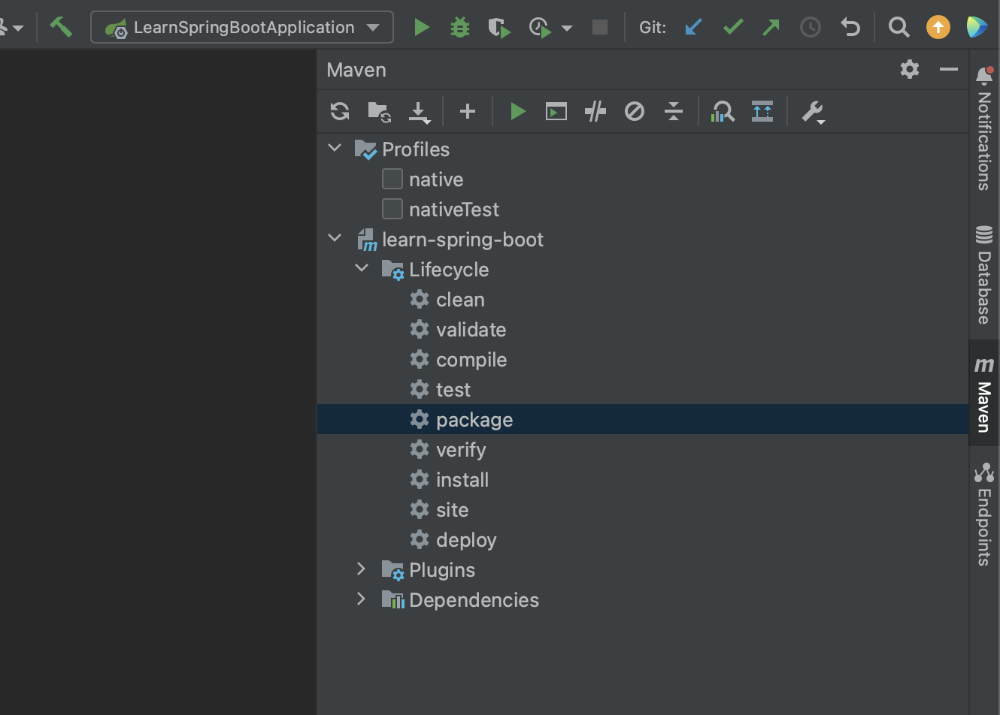

# Spring Boot 시작하기

**목표**
- 왜 Spring Boot인가?
- Spring Boot는 무엇을 위한 것인가?
- Spring Boot는 어떻게 동작하나?
- Spring Boot vs. Spring MVC vs. Spring

---

## Spring Boot 이전의 세상

Spring 프로젝트를 세팅하는 것은 매우 복잡한 일이었다.
- pom.xml을 통해 의존성 관리를 해야 하고
- web.xml을 통해 웹앱 설정을 정의해야 하고
- context.xml을 통해 Bean을 관리해야 하고
- NFR(Non Functional Requirements)를 구현해야헀다.
이 많은 작업들을 프로젝트를 생성할 때 마다 해준다니, 이건 아니다!

---

## Spring Boot의 목적

**PRODUCTION-READY** 어플리케이션을 빠르게 제작한다.
- 빠르게
    - Spring Initializr(start.spring.io)
    - Spring Boot Starter Projects
    - Spring Boot Auto Configuration
    - Spring Boot DevTools
- PRODUCTION-READY
    - 로깅
    - 환경에 따라 다른 설정 (dev, stg, prod)
    - 모니터링 (Spring Boot Actuator)

## Spring Boot의 동작

### Spring Boot Starter Proejcts
어플리케이션을 만들 땐 많은 프레임워크들이 필요하다. Spring Boot Starter Projects는 다양한 프레임워크를 제공하는 공구 세트라고 할 수 있다. Spring Boot는 이런 다양한 스타터 프로젝트를 제공한다.
- spring-boot-starter: 스프링 컨텍스트를 정의할 수 있다.
- spring-boot-starter-web: 웹앱, REST API를 만들 수 있다.
- spring-boot-starter-test: 유닛 테스트를 만들 수 있다.
- spring-boot-starter-json: Bean과 JSON간의 변환을 가능하게 한다.
- spring-boot-starter-tomcat: 톰캣으로 앱을 구동할 수 있게 한다.
- spring-web
- spring-webmvc

### Spring Boot Auto Configuration
스프링 앱을 개발하는데 많은 설정들이 필요하다. Spring Boot Auto Configuration은 이를 간소화 하는데 도움을 준다. 이는 org.springframework.boot:spring-boot-autoconfigure 라는 패키지 이름으로 jar 파일로 설치되어있을 것이다. 이 안에 각종 스프링 프레임워크에 대한 자동 설정 기능들이 들어가있다. src > main > resources > application.properties에 'logging.level.org.springframework=info' 처럼 설정을 선언하여 세부 설정을 커스터마이징 할 수 있다.

### Spring Boot Dev Tools
Hot reload로 디버깅 속도를 단축시켜준다. 다만 IntelliJ IDEA에선 작동하지 않는 듯 하다...그리고 pom.xml이 바뀌면 무조건 다시 빌드해야된다.

---
 
## 프로덕션 환경 배포 준비

### Profile
어플리케이션은 dev, qa, stg, prod 등 다양한 환경을 가질 수 있다. 각 환경은 각자의 설정이 필요하다. 각 환경마다 다른 데이터베이스, 다른 웹서비스 등이 필요하다는 것이다. 그리고 이것을 Profile을 통해 적용 가능하다. src > main > java > resources > application.properties-{환경 이름}과 같은 파일을 만들어 여기에 각 환경마다 필요한 설정 값을 입력한다. 그리고 메인 설정 파일이라 할 수 있는 src > main > java > resources > application.properties에는 다음과 같은 설정값을 넣음으로써 적용할 profile을 지정한다: spring.profiles.active=prod
```
(src > main > resources)

application.properties
application-dev.properties
application-stg.properties
application-prod.properties
```
```
(application.properties)

spring.profiles.active=dev
```

### ConfigurationProperties
Profile에 정의한 설정 값을 코드에서 사용하려면 이를 위한 컴포넌트를 만들면 된다. 예를들어 다음과 같은 설정 값을 선언했다고 하자.
```
(application.properties)

spring.profiles.active=prod

currency-service.url=https://default.ade.com
currency-service.username=deafultusername
currency-service.key=defaultkey
``` 
이는 활성화 할 설정이 'application-dev.properties'라는 뜻이고, 그 아래 'currency-service'의 url, username, key 값으로 각각 'https://default.ade.com', 'defaultusername', 'key'를 넣어줬다는 뜻이다. 그럼 이를 실제 코드에서 사용하기 위해선 다음과 같이 컴포넌트 클래스를 만들어주면 된다. @ConfigurationProperties 어노테이션을 통해 "currency-service"라는 이름의 설정값을 참조한다고 선언하고 @Component 어노테이션을 통해 Spring 컴포넌트임을 선언한다.
```java
@ConfigurationProperties(prefix = "currency-service")
@Component
public class CurrencyServiceConfiguration {

    private String url;
    private String username;
    private String key;

    public String getUrl() {
        return url;
    }

    public void setUrl(String url) {
        this.url = url;
    }

    public String getUsername() {
        return username;
    }

    public void setUsername(String username) {
        this.username = username;
    }

    public String getKey() {
        return key;
    }

    public void setKey(String key) {
        this.key = key;
    }
}
```
이렇게 하면 자동으로 CurrencyServiceConfiguration 객체가 생성되고 초기화되는데, 이를 확인하기 위해 다음과 같은 REST API 클래스를 만들자.
```java
@RestController
public class CurrencyConfigurationController {

    @Autowired
    private CurrencyServiceConfiguration configuration;

    @RequestMapping("/currency-configuration")
    public CurrencyServiceConfiguration retrieveAllCourses() {
        return configuration;
    }

}
```
이제 다음과 같은 메인 함수를 실행시킨다.
```java
@SpringBootApplication
public class LearnSpringBootApplication {

    public static void main(String[] args) {
        SpringApplication.run(LearnSpringBootApplication.class, args);
    }

}

```
자, 이제 브라우저에 접속해서 'localhost:8080/currency-configuration'을 접속해보자. 다음과 같은 JSON이 출력됨을 확인할 수 있다.
```
{
    "url": "https://default.ade.com",
    "username": "deafultusername",
    "key": "defaultkey"
}
```

### Embedded Server
일반적으로 웹 서비스를 배포할 때, 크게 3단계를 거친다.
1. Java 설치
2. 웹/어플리케이션 서버 설치 (Tomcat, WebSphere, WebLogic, ...)
3. WAR 파일 배포 (WAR: Web ARchive)

임베디드 서버를 활용한다면 이를 다음과 같이 간소화 할 수 있다.

1. Java 설치
2. JAR 파일 실행
이걸 intellJ IDEA에서 실행해보자. 우선 지금까지 만든 프로젝트를 빌드하여 jar 파일을 만들자.

우측의 maven 창을 열고 <project-name> > Lifecycle > package를 더블클릭하면 다음과 같은 로그와 함께 jar 파일이 만들어질 것이다.
```
[INFO] Tests run: 1, Failures: 0, Errors: 0, Skipped: 0, Time elapsed: 2.975 s - in com.ade.springboot.learnspringboot.LearnSpringBootApplicationTests
[INFO] 
[INFO] Results:
[INFO] 
[INFO] Tests run: 1, Failures: 0, Errors: 0, Skipped: 0
[INFO] 
[INFO] 
[INFO] --- jar:3.3.0:jar (default-jar) @ learn-spring-boot ---
[INFO] 
[INFO] --- spring-boot:3.1.2:repackage (repackage) @ learn-spring-boot ---
[INFO] Replacing main artifact /Users/jinwoo/Desktop/라이징캠프+/Rising-Camp-Plus-Backend/Week 3/learn-spring-boot/target/learn-spring-boot-0.0.1-SNAPSHOT.jar with repackaged archive, adding nested dependencies in BOOT-INF/.
[INFO] The original artifact has been renamed to /Users/jinwoo/Desktop/라이징캠프+/Rising-Camp-Plus-Backend/Week 3/learn-spring-boot/target/learn-spring-boot-0.0.1-SNAPSHOT.jar.original
[INFO] ------------------------------------------------------------------------
[INFO] BUILD SUCCESS
[INFO] ------------------------------------------------------------------------
[INFO] Total time:  5.887 s
[INFO] Finished at: 2023-07-25T20:49:36+09:00
[INFO] ------------------------------------------------------------------------
```

/Users/jinwoo/Desktop/라이징캠프+/Rising-Camp-Plus-Backend/Week 3/learn-spring-boot/target/learn-spring-boot-0.0.1-SNAPSHOT.jar 바로 이 파일이 빌드된 jar 파일이다. 이제 터미널을 열어 java -jar <jar-file-path>를 입력해주자. 해당 jar 파일이 실행되고 localhost:8080을 접속하면 내가 만든 API를 확인할 수 있을 것이다. 이게 가능한 이유는 Spring Boot Starter Projects 중 하나인 spring-boot-starter-web을 현재 프로젝트에서 사용하고 있는데, 여기에 spring-boot-starter-tomcat 이라는, 톰캣 서버가 임베드 되어있기 때문이다. 이 외에도 임베디드 서버에는 spring-boot-starter-jetty, spring-boot-starter-undertow 등이 있다.

### Actuator
Spring Boot Actuator는 어플리케이션 모니터링을 도와준다. pom.xml에 다음과 같이 의존성을 추가하자.
```xml
<dependency>
    <groupId>org.springframework.boot</groupId>
    <artifactId>spring-boot-starter-actuator</artifactId>
</dependency>
```
이렇게 actuator를 추가하고 다시 앱을 실행시킨다. 그리고 localhost:8080/actuator로 접속해보면 다음과 같은 JSON이 보일 것이다.
```json
{
    "_links": {
        "self": {
            "href": "http://localhost:8080/actuator",
            "templated": false
        },
        "health": {
            "href": "http://localhost:8080/actuator/health",
            "templated": false
        },
        "health-path": {
            "href": "http://localhost:8080/actuator/health/{*path}",
            "templated": true
        }
    }
}
```
여기에 나타난 각 항목에 대한 href 링크를 타고 들어가면 서로다른 종류의 정보를 확인할 수 있다. 그런데 생각보다 정보가 빈약하지 않은가? 띄울 수 있는 모든 정보를 다 띄워보도록 하자. application.properties에 다음과 같은 설정을 추가하도록 하자.
```
management.endpoints.web.exposure.include=*
```
이제 다시 앱을 실행시키고 /actuator 경로로 접속하면 훨씬 더 많은 모니터링 정보들을 확인할 수 있을 것이다. 그 중에 beans 항목을 확인해보자.
```json
"beans": {
    "href": "http://localhost:8080/actuator/beans",
    "templated": false
},
```
beans는 현재 스프링 애플리케이션이 가지고 있는 모든 Bean 객체들을 보여준다. href 링크를 타고 들어가보자.
```json
{
    "contexts": {
        "application": {
            "beans": {
                "endpointCachingOperationInvokerAdvisor": {
                    "aliases": [],
                    "scope": "singleton",
                    "type": "org.springframework.boot.actuate.endpoint.invoker.cache.CachingOperationInvokerAdvisor",
                    "resource": "class path resource [org/springframework/boot/actuate/autoconfigure/endpoint/EndpointAutoConfiguration.class]",
                    "dependencies": [
                        "org.springframework.boot.actuate.autoconfigure.endpoint.EndpointAutoConfiguration",
                        "environment"
                    ]
                },
                "defaultServletHandlerMapping": {
                    "aliases": [],
                    "scope": "singleton",
                    "type": "org.springframework.web.servlet.HandlerMapping",
                    "resource": "class path resource [org/springframework/boot/autoconfigure/web/servlet/WebMvcAutoConfiguration$EnableWebMvcConfiguration.class]",
                    "dependencies": [
                        "org.springframework.boot.autoconfigure.web.servlet.WebMvcAutoConfiguration$EnableWebMvcConfiguration"
                    ]
                },
            ...
            }
            ...
        }
        ...
    }
    ...
}
```
엄청나게 긴 JSON 리스트를 볼 수 있다. 말 그대로 모든 Bean들을 한꺼번에 리스트업 해서 그렇다. 내가 만든건 거의 없는데 시스템 Bean들이 이렇게나 많은 것을 알 수 있다. 이 외에도 "configprops"를 통해 아까 설정했던 설정값들도 확인할 수 있다.

---

## Spring, Spring MVC, Spring Boot
- Spring Framework는 다양한 의존성을 관리하는 것이 핵심(Dependency Injection)
    - @Component, @Autowired, @ComponentScan
- Spring MVC는 웹앱과 REST API 제작을 간소화하는 것이 핵심
    - @Controller, @RestController, @RequestMapping
- Spring Boot는 Wrapper이다. PRODUCTION-READY 상태의 앱을 빠르게 빌드하는 것이 핵심
    - Starter projects, Auto configurations, NFR(non functional requirements: Actuator, Embedded Server, Profiles, ConfigurationProperties...)
