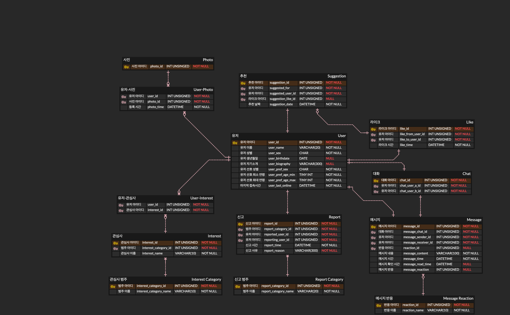

# 04. Tinder API 설계

## ERD

## API List
|  | 기능 | 메서드 | 경로 |
| -- | -- | -- | -- |
| 1 | 유저 전체 조회 | GET | /user/all |
| 2 | 유저별 보낸 라이크 조회 | GET | /user/{userId}/likes-sent |
| 3 | 유저별 받은 라이크 조회 | GET | /user/{userId}/likes-received |
| 4 | 유저별 관심사 조회 | GET | /user/{userId}/interests |
| 5 | 유저별 추천 전체 조회 | GET | /user/{userId}/suggestions |
| 6 | 유저별 대화 목록 조회 | GET | /user/{userId}/chats |
| 7 | 라이크 전체 조회 | GET | /like/all |
| 8 | 매치 전체 조회 | GET | /like/match/all |
| 9 | 라이크하기 | POST | /like |
| 10 | 라이크 되돌리기 | POST | /like/revert |
| 11 | 유저간 라이크 여부 조회 | GET | /like?user-a={userId}&user-b={userId} |
| 12 | 관심사 전체 조회 | GET | /interest/all |
| 13 | 관심사 카테고리 전체 조회 | GET | /interest-category/all |
| 14 | 신고 전체 조회 | GET | /report/all |
| 15 | 신고 카테고리 전체 조회 | GET | /report-category/all |
| 16 | 신고하기 | POST | /report |
| 17 | 신고 취소하기 | DELETE | /report |
| 18 | 대화 전체 조회 | GET | /chat/all |
| 19 | 대화별 메시지 목록 조회 | GET | /chat/{chatId}/messages |
| 20 | 메시지 보내기 | POST | chat/message |
| 21 | 메시지 반응 목록 조회 | GET | chat/message/reaction/all |
| 22 | 메시지 반응 보내기 | POST | chat/message/reaction |
| 22 | 대화 삭제하기 | DELETE | /chat |
