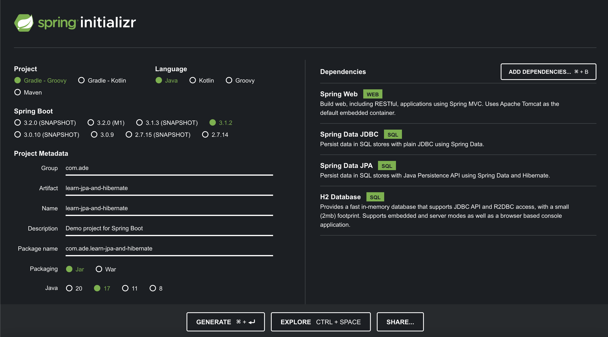
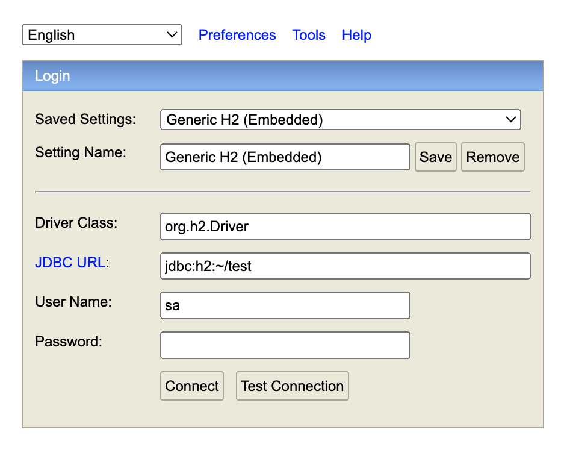
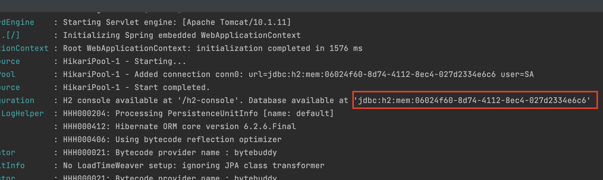
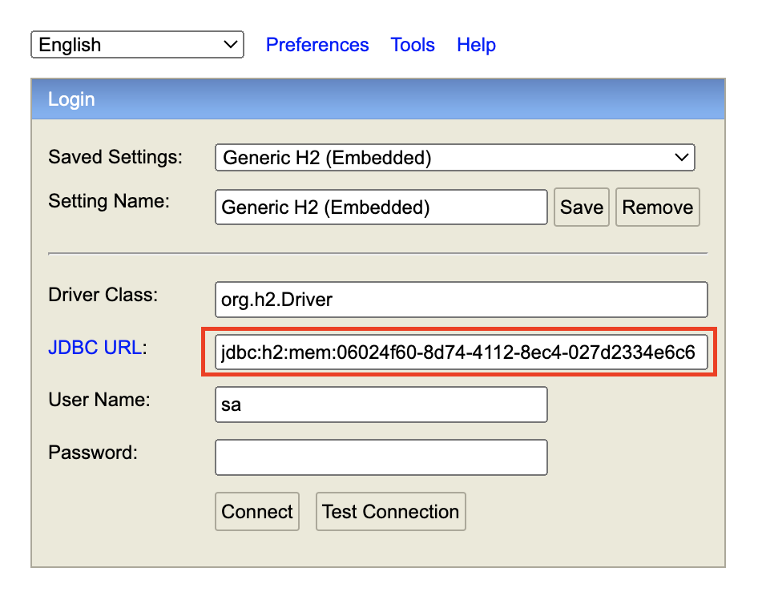
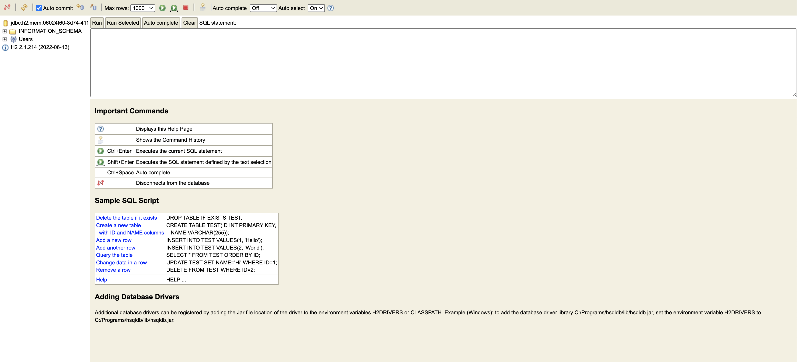
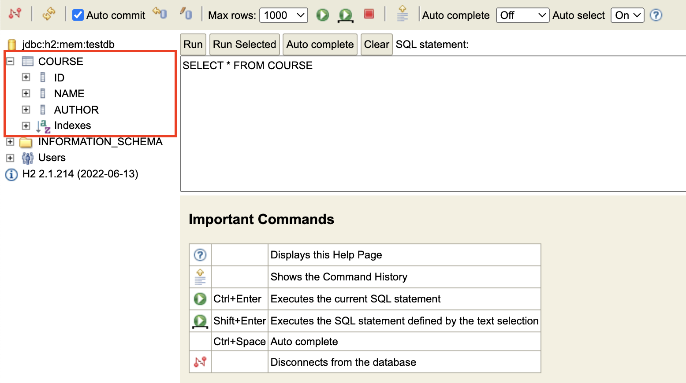
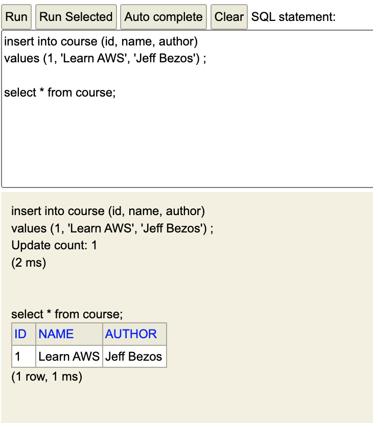

# 1. JPA & Hibernate

## 목차
1. Spring Boot 프로젝트 생성 & H2 콘솔 설정
2. COURSE 테이블 생성
3. Spring JBDC를 이용해 COURSE 테이블 갖고놀기
4. JPA & Hibernate를 이용해 COURSE 테이블 갖고놀기
5. Spring Data JPA를 이용해 COURSE 테이블 갖고놀기

---

## 프로젝트 생성 & H2 콘솔 설정

프로젝트 생성은 start.spring.io 에서 다음과 같이 설정하여 생성한다.

application.properties 파일에 가서 다음 설정을 입력한다.
```
(application.properties)

spring.h2.console.enabled=true
```
그리고 앱을 실행하여 localhost:8080/h2-console에 접속하면 다음과 같은 화면이 뜬다.


IDE의 로그 창을 보면 다음과 같이 랜덤으로 생성되는 URL을 볼 수 있는데,


이것을 복사해서 JDBC URL에 넣는다. 그리고 Connect를 누르면,


다음과 같은 h2 콘솔 화면이 뜬다.


이 화면을 자주 봐야하는데, 이 JDBC URL은 매번 랜덤하게 생성되므로 이를 고정된 값으로 설정해보자.
다시 application.properties로 돌아가 다음 줄을 추가한다. testdb라는 경로를 지정하였다.
```
(application.properties)

spring.h2.console.enabled=true
spring.datasoure.url=jdbc:h2:mem:testdb
```
이제 해당 URL을 다시 JDBC URL에 입력하면 고정된 경로로 h2 콘솔에 접속할 수 있다.

---

## COURSE 테이블 생성

이제 갖고놀 데이터를 만들어보자. 프로젝트의 src  > main> resources 아래 schema.sql이라는 파일을 생성하고 다음과 같은 SQL문을 입력한다.
```sql
create table course
(
    id bigint not null,
    name varchar(255) not null,
    author varchar(255) not null,
    primary key (id)
);
```
그리고 앱을 다시 실행하면 H2가 자동으로 schema.sql 파일을 인식하여 해당 SQL을 실행할 것이다. 콘솔창을 확인해보면 다음과 같이 테이블이 추가된 것은 확인할 수 있을 것이다. 이제 여기의 입력 필드에 SQL을 입력하여 실행하면 데이터베이스를 갖고 놀 수 있다.


---

## Spring JBDC로 COURSE를 갖고 놀자

먼저 INSERT를 시도해보자. 다음과 같은 SQL을 H2 콘솔 입력 필드에 입력하자.
```sql
insert into course (id, name, author) 
values (1, 'Learn AWS', 'Jeff Bezos') ;

select * from course;
``` 
다음과 같은 결과가 출력되는 것을 알 수 있을 것이다. 


단, 앱을 실행할 때 마다 데이터는 초기화되므로, 항상 사용하고자 하는 데이터가 있다면 그 데이터를 INSERT 하는 SQL도 매번 실행해야된다. 따라서 데이터를 초기화하는 SQL을 미리 작성하여 별도의 파일로 저장한 다음, 이를 실행할 때 마다 호출하도록 설정해야 한다. 

### Spring JBDC는 그냥 JBDC를 이용할 때에 비해 코드량을 확 줄여준다.

JDBC를 사용하면 많은 SQL과 Java 코드를 사용하게 될 것이다. 다음은 JDBC로 엔티티를 삭제하는 예시이다.
```java
public void delete(int id) {
    PreparedStatement st = null;
    try {
        st = db.conn.prepareStatement("delete from course where id=?");
        st.setInt(1, id);
        st.execute();
    } catch (SQLException e) {
        logger.fatal("Query failed:", e);
    } finally {
        if (st != null) {
            try { st.close(); }
            catch (SQLException e) {}
        }
    }
}
```
Spring JBDC를 사용하면 SQL은 똑같이 쓰지만 다음과 같이 훨씬 적은 Java 코드를 사용하게 될 것이다.
```java
public void delete(int id) {
    jdbcTemplate.update("delete from course where id=?", id);
}
```
### Spring JBDC 용법

그럼 Spring JBDC를 사용하는 법을 본격적으로 알아보자. 우선 다음과 같이 Repository 클래스를 만든다. 예시를 위해 INSERT_QUERY라는 특정 아이템 삽입 쿼리를 미리 입력해놓았다. JdbcTemplate라는 의존성을 주입받는 것을 알 수 있다. 이것이 데이터 조작을 처리하는 객체이다.
```java
import org.springframework.beans.factory.annotation.Autowired;
import org.springframework.jdbc.core.JdbcTemplate;
import org.springframework.stereotype.Repository;

@Repository
public class CourseJDBCRepository {

    @Autowired
    private JdbcTemplate template;

    private static final String INSERT_QUERY =
            """
                insert into course (id, name, author)
                values (1, 'Learn AWS', 'Jeff Bezos');
            """;

    public void insert() {
        template.update(INSERT_QUERY);
    }

}
```

그리고 이 Repository를 실행하는 객체는 CommandLineRunner이다. 다음과 같이 CommandLineRunner 구현체 클래스를 만든다. 아까만든 Repository 클래스를 주입받고 있다. run 메서드를 오버라이드하여 repository에 정의된 SQL 동작을 실행한다.
```java
import org.springframework.beans.factory.annotation.Autowired;
import org.springframework.boot.CommandLineRunner;
import org.springframework.stereotype.Component;

@Component
public class CourseJDBCCommandLineRunner implements CommandLineRunner {

    @Autowired
    private CourseJDBCRepository repository;

    @Override
    public void run(String... args) throws Exception {
        repository.insert();
    }

}
```

이렇게 코드를 짰으면 앱을 다시 실행한다. 그러면 처음부터 (1, Learn AWS, Jeff Bezos) 항목이 테이블에 입력되어있는 것을 확인할 수 있을 것이다. 이제 다음과 같이 Repository를 변경해보자. 참고로 Course는 long id, String name, String author를 데이터로 가지는 클래스로 정의하였다.
```java
import com.ade.learnjpaandhibernate.course.models.Course;
import org.springframework.beans.factory.annotation.Autowired;
import org.springframework.jdbc.core.BeanPropertyRowMapper;
import org.springframework.jdbc.core.JdbcTemplate;
import org.springframework.stereotype.Repository;

@Repository
public class CourseJDBCRepository {

    @Autowired
    private JdbcTemplate template;

    private static final String INSERT_QUERY =
            """
                insert into course (id, name, author)
                values (?, ?, ?);
            """;

    private static final String DELETE_QUERY =
            """
                delete from course 
                where id = ?
             """;

    private static final String SELECT_QUERY =
            """
                select * from course
                where id = ?
            """;

    public void insert(Course course) {
        this.template.update(INSERT_QUERY, course.getId(), course.getName(), course.getAuthor());
    }

    public void deleteById(long id) {
        this.template.update(DELETE_QUERY, id);
    }

    public Course findById(long id) {
        return this.template.queryForObject(
                SELECT_QUERY,
                new BeanPropertyRowMapper<>(Course.class),
                id
        );
    }

}

```
위 코드는 실제 데이터를 입력받아 INSERT, DELETE, SELECT를 수행하는 Repository 클래스이다. 이제 CommandLineRunner 클래스의 run 메서드에서 다음과 같은 호출을 하면,
```java
import com.ade.learnjpaandhibernate.course.models.Course;
import org.springframework.beans.factory.annotation.Autowired;
import org.springframework.boot.CommandLineRunner;
import org.springframework.stereotype.Component;

@Component
public class CourseJDBCCommandLineRunner implements CommandLineRunner {

    @Autowired
    private CourseJDBCRepository repository;

    @Override
    public void run(String... args) throws Exception {
        repository.insert(new Course(1, "Learn AWS Now", "Jeff Bezos"));
        repository.insert(new Course(2, "Learn Azure Now", "Satya Nadela"));
        repository.insert(new Course(3, "Learn DevOps Now", "Jinwoo"));
        repository.deleteById(3);
        System.out.println(repository.findById(1));
        System.out.println(repository.findById(2));
    }

}
```
결과적으로 다음과 같은 출력을 볼 수 있을 것이다. 참고로 Course 클래스의 toString 메서드를 오버라이드했다.
```
Course(id=1, name=Learn AWS Now, author=Jeff Bezos)
Course(id=2, name=Learn Azure Now, author=Satya Nadela)
```

--- 

## JPA & Hibernate로 COURSE 테이블 갖고놀기
