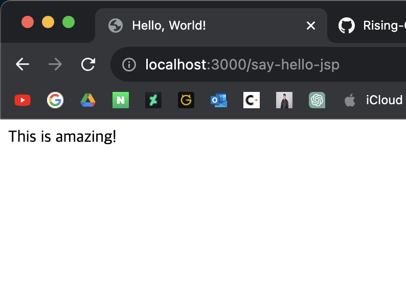
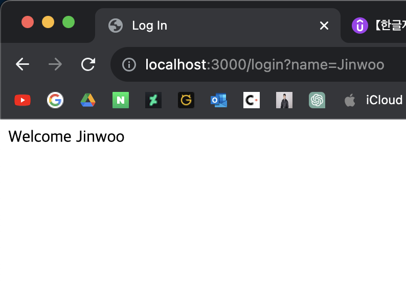

# 2. Java 웹앱 만들기

## 목표: 모던 스프링 부트 접근법을 통해 투두 리스트 웹앱을 만든다.

### 프로젝트 생성
다음과 같은 설정으로 프로젝트를 생성한다.


---

### JSP로 리디렉션하여 웹페이지 띄우기

1. build.gradle에 다음과 같은 의존성을 추가한다.
```groovy
implementation 'org.apache.tomcat.embed:tomcat-embed-jasper'
```
2. application.properties에는 다음과 같은 두줄을 입력한다. 이는 앞으로 jsp 파일의 경로를 호출할 때 편하게 하기위해 미리 경로와 확장자를 선언해놓는 것이다.
```
(application.properties)

spring.mvc.view.prefix=/WEB-INF/jsp/
spring.mvc.view.suffix=.jsp
```

3. src > main > resources > META-INF > resources > WEB-INF > jsp 디렉터리를 생성한다. 그리고 여기에 jsp 파일을 저장할 것이다. 다음과 같은 간단한 jsp 파일을 작성해보자.
```html
(hello.jsp)

<html>
    <head>
        <title>Hello, World!</title>
    </head>
    <body>
        This is amazing!
    </body>
</html>
```

4. 이제 다음과 같은 Controller 클래스를 만들자.
```java
import org.springframework.stereotype.Controller;
import org.springframework.web.bind.annotation.RequestMapping;

@Controller
public class HelloController {

    @RequestMapping("say-hello-jsp")
    public String sayHelloJSP() {
        return "hello";
    }

}
```

이렇게 하고 앱을 실행한다. 브라우저에 'localhost:8080/say-hello-jsp'를 치면 해당 HTML 파일이 렌더링 된 모습을 볼 수 있다.



---

### 로그인 기능 구현

같은 방식으로 로그인 페이지를 만들어보자. src > main > resources > META-INF > resources > WEB-INF > jsp > login.jsp 파일을 만들고 다음과 같이 HTML을 입력하자. 여기서 'name'이라는 자바 변수를 가져다 쓰려고 한다. ${} 이렇게 변수를 표현하는 것을 Expression Language라고 한다. 그럼 이 name 값은 어디서 오는가.
```html
<html>
    <head>
        <title>Log In</title>
    </head>
    <body>
        Welcome ${name}
    </body>
</html>
```

다음과 같이 ModelMap이라는 것을 이용한다. 아래 함수는 localhost:8080/login?name={name} 처럼 쿼리로 변수 name을 받고 있는데, 이 값을 그대로 ModelMap에 전달해주면 된다.
```java
import org.springframework.stereotype.Controller;
import org.springframework.ui.ModelMap;
import org.springframework.web.bind.annotation.RequestMapping;
import org.springframework.web.bind.annotation.RequestParam;

@Controller
public class LogInController {

    @RequestMapping(value = "login")
    public String goToLogInPage(@RequestParam String name, ModelMap model) {
        model.put("name", name);;
        return "login";
    }

}
```

앱을 실행하고 브라우저에서 localhost:8080/login?name=Jinwoo를 호출하면 다음과 같은 화면이 뜰 것이다.
 


### 로깅하는 방법

```java
import org.slf4j.Logger;
import org.slf4j.LoggerFactory;
import org.springframework.stereotype.Controller;
import org.springframework.ui.ModelMap;
import org.springframework.web.bind.annotation.RequestMapping;
import org.springframework.web.bind.annotation.RequestParam;

@Controller
public class LogInController {

    // org.slf4j의 Logger 객체를 만들어준다.
    private Logger logger = LoggerFactory.getLogger(getClass());

    @RequestMapping(value = "login")
    public String goToLogInPage(@RequestParam String name, ModelMap model) {
        model.put("name", name);
        // debug를 호출하면 로그 레벨이 'debug'일 때만 노출된다.
        logger.debug("Request param is {}", name);
        // info를 호출하면 로그 레벨이 'info'일 때만 노출된다.
        logger.info("Request param is {}", name);
        // 'warn' 레벨도 있다.
        logger.warn("Request param is {}", name);
        return "login";
    }

}
```

로그 레벨은 application.properties에서 클래스 단위로 설정할 수 있다.
```
(application.properties)

logging.level.org.springframework=info // 전체에 대해선 info
logging.level.com.ade.myfirstwebapp.login.LogInController=debug // LogInController에 대해선 debug
```

---

### 
