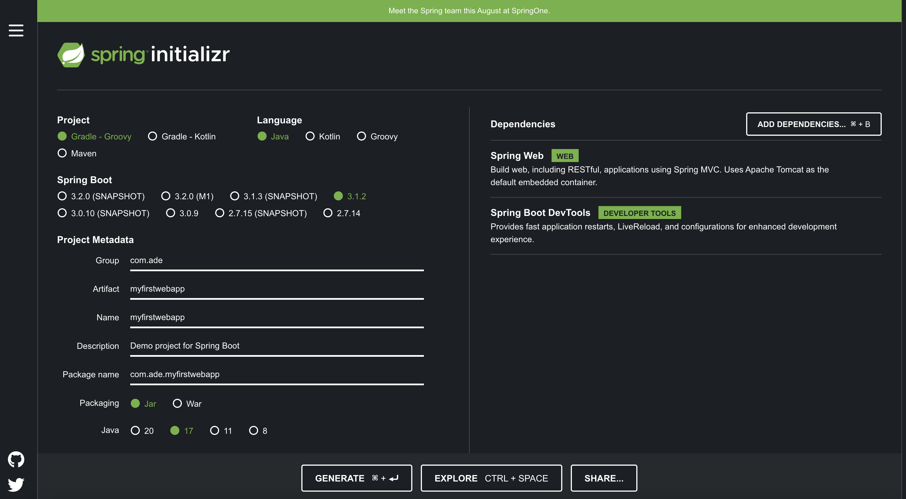

# 2. Java 웹앱 만들기

## 목표: 모던 스프링 부트 접근법을 통해 투두 리스트 웹앱을 만든다.

다음과 같은 설정으로 프로젝트를 생성한다.


### JSP로 리디렉션하여 웹페이지 띄우기

1. build.gradle에 다음과 같은 의존성을 추가한다.
```groovy
implementation 'org.apache.tomcat.embed:tomcat-embed-jasper'
```
2. application.properties에는 다음과 같은 두줄을 입력한다. 이는 앞으로 jsp 파일의 경로를 호출할 때 편하게 하기위해 미리 경로와 확장자를 선언해놓는 것이다.
```
(application.properties)

spring.mvc.view.prefix=/WEB-INF/jsp/
spring.mvc.view.suffix=.jsp
```

3. src > main > resources > META-INF > resources > WEB-INF > jsp 디렉터리를 생성한다. 그리고 여기에 jsp 파일을 저장할 것이다. 다음과 같은 간단한 jsp 파일을 작성해보자.
```html
(hello.jsp)

<html>
    <head>
        <title>Hello, World!</title>
    </head>
    <body>
        This is amazing!
    </body>
</html>
```

4. 이제 다음과 같은 Controller 클래스를 만들자.
```java
import org.springframework.stereotype.Controller;
import org.springframework.web.bind.annotation.RequestMapping;

@Controller
public class HelloController {

    @RequestMapping("say-hello-jsp")
    public String sayHelloJSP() {
        return "hello";
    }

}
```

이렇게 하고 앱을 실행한다. 브라우저에 'localhost:8080/say-hello-jsp'를 치면 해당 HTML 파일이 렌더링 된 모습을 볼 수 있다.

