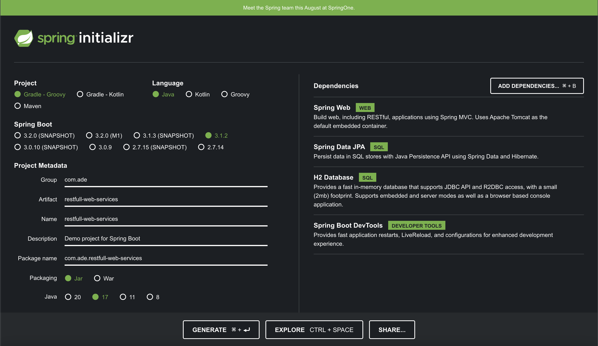
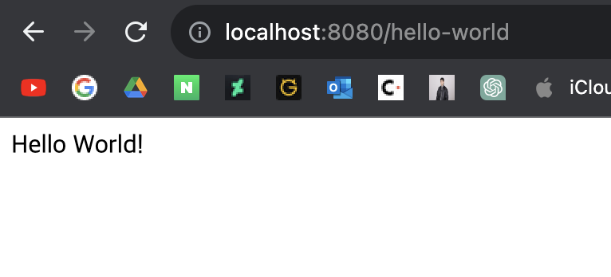

# 3. Java REST API 만들기

## 목표
- 왜 REST API를 개발하는데 Spring Boot를 이용하는 것이 좋은지 이해
- Spring Boot로 REST API를 만드는 방법을 습득

## 단계
1. Hello World REST API
    - @RestController, @RequestMapping, @PathVariable, JSON conversion
2. 소셜 미디어 앱을 위한 REST API
    - 올바른 URI를 작성한는 법
    - 올바른 메서드를 선택하는 법
    - 요청/응답 형식 구성
    - 보안, 유효성 검사, 예외 처리
    - 고급: Internalization, HATEOAS, Versioning, Documenttation, Content Negotiation
3. 데이터베이스 연동
    - JPA & Hibernate
    - H2 & MySQL
    
---

## Hello World REST API

다음과 같은 세팅으로 스프링 프로젝트를 생성한다.


우선 목적은 "Hello World!"라는 스트링을 반환하는 메서드를 REST API로 구현하는 것이다. 이를 위한 컨트롤러 클래스인 HelloWorldController를 만드는데 다음과 같은 구조로 먼저 만들어보자. 이 간단한 클래스와 메서드를 REST API로 만들어보자.
```java
public class HelloWorldController {

    public String helloWorld() {
        return "Hello World!";
    }

}
```

우선 다음과 같은 어노테이션을 붙여보자. 클래스엔 @RestController를, 메서드엔 @RequestMapping을 붙였다. 메서드 종류는 GET, 경로는 'hello-world'로 설정하였다.
```java
@RestController
public class HelloWorldController {

    @RequestMapping(method = RequestMethod.GET, path = "/hello-world")
    public String helloWorld() {
        return "Hello World!";
    }

}
```

이제 앱을 실행시키고 localhost:8080/hello-world로 접속하면 다음과 같이 "Hello World!"가 반환되는 것을 확인할 수 있을 것이다.



