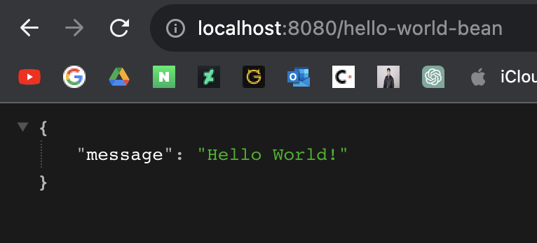

# 3. Java REST API 만들기

## 목표
- 왜 REST API를 개발하는데 Spring Boot를 이용하는 것이 좋은지 이해
- Spring Boot로 REST API를 만드는 방법을 습득

## 단계
1. Hello World REST API
    - @RestController, @RequestMapping, @PathVariable, JSON conversion
2. 소셜 미디어 앱을 위한 REST API
    - 올바른 URI를 작성한는 법
    - 올바른 메서드를 선택하는 법
    - 요청/응답 형식 구성
    - 보안, 유효성 검사, 예외 처리
    - 고급: Internalization, HATEOAS, Versioning, Documenttation, Content Negotiation
3. 데이터베이스 연동
    - JPA & Hibernate
    - H2 & MySQL
    
---

## Hello World REST API

다음과 같은 세팅으로 스프링 프로젝트를 생성한다.


우선 목적은 "Hello World!"라는 스트링을 반환하는 메서드를 REST API로 구현하는 것이다. 이를 위한 컨트롤러 클래스인 HelloWorldController를 만드는데 다음과 같은 구조로 먼저 만들어보자. 이 간단한 클래스와 메서드를 REST API로 만들어보자.
```java
public class HelloWorldController {

    public String helloWorld() {
        return "Hello World!";
    }

}
```

우선 다음과 같은 어노테이션을 붙여보자. 클래스엔 @RestController를, 메서드엔 @RequestMapping을 붙였다. 메서드 종류는 GET, 경로는 'hello-world'로 설정하였다.
```java
@RestController
public class HelloWorldController {

    // GET 메서드의 경우, 선언을 생략해도 된다.
    // @RequestMapping("/hello-world") 이렇게만 해줘도 된다는 얘기 
    @RequestMapping(method = RequestMethod.GET, path = "/hello-world")
    public String helloWorld() {
        return "Hello World!";
    }

}
```

이제 앱을 실행시키고 localhost:8080/hello-world로 접속하면 다음과 같이 "Hello World!"가 반환되는 것을 확인할 수 있을 것이다.


이번엔 스트링이 아니라 JSON 데이터를 반환하는 REST API를 만들어보자. 다음과 같이 HelloWorldController에 메서드를 추가한다.
```java
@RestController
public class HelloWorldController {

    @RequestMapping("/hello-world")
    public String helloWorld() {
        return "Hello World!";
    }

    @RequestMapping( "/hello-world-bean")
    public HelloWorldBean helloWorldBean() {
        return new HelloWorldBean("Hello World!");
    }

}
```

여기서 HelloWorldBean이라는 클래스를 새로 만들어준다. HelloWorldBean은 다음과 같이 작성헌다.
```java
public class HelloWorldBean {

    private String message;

    public HelloWorldBean(String message) {
        this.message = message;
    }

    // JSON으로 변환하기 위해 getter는 반드시 구현해야 한다. 
    public String getMessage() {
        return message;
    }

    public void setMessage(String message) {
        this.message = message;
    }

    @Override
    public String toString() {
        return "HelloWorldBean [message=" + message + "]";
    }

}
```

이제 다시 앱을 실행하고 localhost:8080/hello-world-bean에 접속하면 다음과 같은 결과가 나올 것이다.


모든 HTTP 요청은 DispatcherServlet이라는 곳으로 가장 먼저 전달된다. DispatcherServlet의 URL은 '/'으로, 현재 도메인의 가장 기본이 되는 경로라고 할 수 있다. DispatcherServlet은 전달받은 요청의 URL을 확인하고 그 경로에 해당하는 적절한 메서드로 연결해준다. 위의 경우, "/hello-world-bean"의 경로를 전달받았으니 그에 해당하는 메서드, 'helloWorldBean'을 실행시킨 것이다. 

DispatcherServlet은 Spring Boot가 자동으로 설정한 것이다. 이러한 작용을 Auto Configuration이라 하는데, 이에 관련된 클래스로 DispatcherServletAutoConfiguration이 있다. HelloWorldBean 객체가 자동으로 JSON으로 변환되는 것 역시 Auto Configuration의 일종이다. JacksonHttpMessageConverter라는 Spring Boot 하위의 컨버터가 자동으로 작동하는 것이다. 그리고 만약 "/hello-world-bean-1" 처럼 존재하지 않는 경로를 접속했을 때 뜨는 오류화면도 Auto Configuration에 의해 작동하는 것인데 이에 관련된 클래스는 ErrorMvcAutoConfiguration이다. 이처럼 편한 Auto Configuration은 다양한 Spring Boot Starter Project에 의해 제공된다.

이처럼 Spring Boot는 각종 Starter Project와 Auto Configuration을 통해 많은 요구사항들을 우리가 일일히 신경쓰지 않아도 되도록 만들어준다. 

이번엔 경로 변수를 받는 API를 만들어보자. HelloWorldController에 다음과 같은 메서드를 추가한다. 메서드 파라미터에 @PathVariable 어노테이션을 붙이고 @RequestMapping의 path 속성에 해당 파라미터 이름을 {} 안에 넣으면 경로로 인식한다.
```java
(HelloWorldController.java)
...

@RequestMapping(value = "/hello-world/path-variable/{name}")
public HelloWorldBean helloWorldBean(@PathVariable String name) {
    return new HelloWorldBean(String.format("Hello, World, %s", name));
}

...
```

앱을 실행시키고 'localhost:8080/hello-world/path-variable/hello'에 접속해보자. 다음과 같은 결과를 볼 수 있다.


---

## 소셜 미디어 앱 REST API

- 메서드 종류
    - GET: 특정 리소스에 대한 세부 내용을 가져올 때
    - POST: 새로운 리소스를 생성할 때
    - PUT: 특정 리소스 전체를 수정할 때
    - PATCH: 특정 리소스의 일부를 수정할 때
    - DELETE: 특정 리소스를 삭제할 때

- 목표: User와 Post 리소스를 조회/생성/수정/삭제할 수 있는 REST API를 만들어보자.
    - Users API
        - 모든 유저 조회: GET /users
        - 새 유저 생성: POST /users
        - 특정 유저 조회: GET /users/{id}
        - 특정 유저 삭제: DELETE /users/{id}
    - Posts API
        - 특정 유저의 모든 글 조회: GET /users/{id}/posts
        - 특정 유저의 새 글 생성: POST /users/{id}/posts
        - 특정 유저의 특정 글 조회: GET /users/{id}/posts/{post_id}
