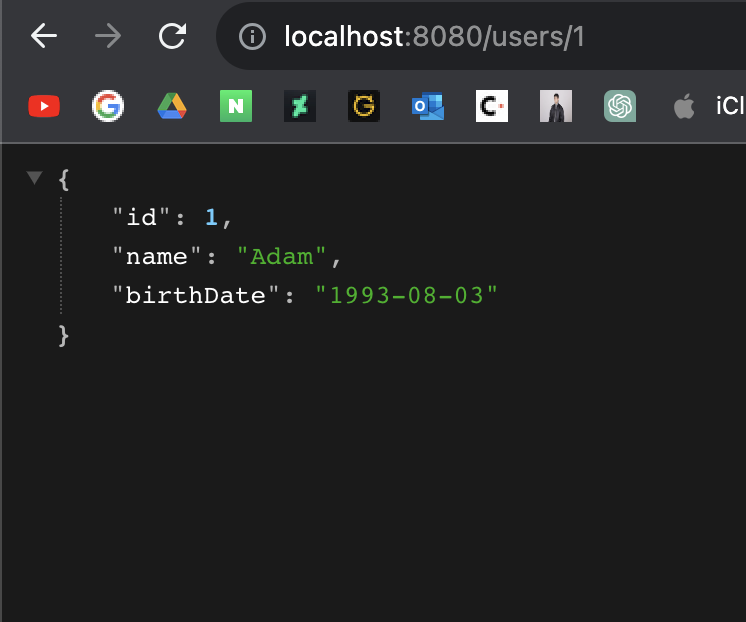

# 3. Java REST API 만들기

## 목표
- 왜 REST API를 개발하는데 Spring Boot를 이용하는 것이 좋은지 이해
- Spring Boot로 REST API를 만드는 방법을 습득

## 단계
1. Hello World REST API
    - @RestController, @RequestMapping, @PathVariable, JSON conversion
2. 소셜 미디어 앱을 위한 REST API
    - 올바른 URI를 작성한는 법
    - 올바른 메서드를 선택하는 법
    - 요청/응답 형식 구성
    - 보안, 유효성 검사, 예외 처리
    - 고급: Internationalization, HATEOAS, Versioning, Documenttation, Content Negotiation
3. 데이터베이스 연동
    - JPA & Hibernate
    - H2 & MySQL
    
---

## Hello World REST API

다음과 같은 세팅으로 스프링 프로젝트를 생성한다.


우선 목적은 "Hello World!"라는 스트링을 반환하는 메서드를 REST API로 구현하는 것이다. 이를 위한 컨트롤러 클래스인 HelloWorldController를 만드는데 다음과 같은 구조로 먼저 만들어보자. 이 간단한 클래스와 메서드를 REST API로 만들어보자.
```java
public class HelloWorldController {

    public String helloWorld() {
        return "Hello World!";
    }

}
```

우선 다음과 같은 어노테이션을 붙여보자. 클래스엔 @RestController를, 메서드엔 @RequestMapping을 붙였다. 메서드 종류는 GET, 경로는 'hello-world'로 설정하였다.
```java
@RestController
public class HelloWorldController {

    // GET 메서드의 경우, 선언을 생략해도 된다.
    // @RequestMapping("/hello-world") 이렇게만 해줘도 된다는 얘기 
    @RequestMapping(method = RequestMethod.GET, path = "/hello-world")
    public String helloWorld() {
        return "Hello World!";
    }

}
```

이제 앱을 실행시키고 localhost:8080/hello-world로 접속하면 다음과 같이 "Hello World!"가 반환되는 것을 확인할 수 있을 것이다.


이번엔 스트링이 아니라 JSON 데이터를 반환하는 REST API를 만들어보자. 다음과 같이 HelloWorldController에 메서드를 추가한다.
```java
@RestController
public class HelloWorldController {

    @RequestMapping("/hello-world")
    public String helloWorld() {
        return "Hello World!";
    }

    @RequestMapping( "/hello-world-bean")
    public HelloWorldBean helloWorldBean() {
        return new HelloWorldBean("Hello World!");
    }

}
```

여기서 HelloWorldBean이라는 클래스를 새로 만들어준다. HelloWorldBean은 다음과 같이 작성헌다.
```java
public class HelloWorldBean {

    private String message;

    public HelloWorldBean(String message) {
        this.message = message;
    }

    // JSON으로 변환하기 위해 getter는 반드시 구현해야 한다. 
    public String getMessage() {
        return message;
    }

    public void setMessage(String message) {
        this.message = message;
    }

    @Override
    public String toString() {
        return "HelloWorldBean [message=" + message + "]";
    }

}
```

이제 다시 앱을 실행하고 localhost:8080/hello-world-bean에 접속하면 다음과 같은 결과가 나올 것이다.


모든 HTTP 요청은 DispatcherServlet이라는 곳으로 가장 먼저 전달된다. DispatcherServlet의 URL은 '/'으로, 현재 도메인의 가장 기본이 되는 경로라고 할 수 있다. DispatcherServlet은 전달받은 요청의 URL을 확인하고 그 경로에 해당하는 적절한 메서드로 연결해준다. 위의 경우, "/hello-world-bean"의 경로를 전달받았으니 그에 해당하는 메서드, 'helloWorldBean'을 실행시킨 것이다. 

DispatcherServlet은 Spring Boot가 자동으로 설정한 것이다. 이러한 작용을 Auto Configuration이라 하는데, 이에 관련된 클래스로 DispatcherServletAutoConfiguration이 있다. HelloWorldBean 객체가 자동으로 JSON으로 변환되는 것 역시 Auto Configuration의 일종이다. JacksonHttpMessageConverter라는 Spring Boot 하위의 컨버터가 자동으로 작동하는 것이다. 그리고 만약 "/hello-world-bean-1" 처럼 존재하지 않는 경로를 접속했을 때 뜨는 오류화면도 Auto Configuration에 의해 작동하는 것인데 이에 관련된 클래스는 ErrorMvcAutoConfiguration이다. 이처럼 편한 Auto Configuration은 다양한 Spring Boot Starter Project에 의해 제공된다.

이처럼 Spring Boot는 각종 Starter Project와 Auto Configuration을 통해 많은 요구사항들을 우리가 일일히 신경쓰지 않아도 되도록 만들어준다. 

이번엔 경로 변수를 받는 API를 만들어보자. HelloWorldController에 다음과 같은 메서드를 추가한다. 메서드 파라미터에 @PathVariable 어노테이션을 붙이고 @RequestMapping의 path 속성에 해당 파라미터 이름을 {} 안에 넣으면 경로로 인식한다.
```java
(HelloWorldController.java)
...

@RequestMapping(value = "/hello-world/path-variable/{name}")
public HelloWorldBean helloWorldBean(@PathVariable String name) {
    return new HelloWorldBean(String.format("Hello, World, %s", name));
}

...
```

앱을 실행시키고 'localhost:8080/hello-world/path-variable/hello'에 접속해보자. 다음과 같은 결과를 볼 수 있다.


---

## 소셜 미디어 앱 REST API

- 메서드 종류
    - GET: 특정 리소스에 대한 세부 내용을 가져올 때
    - POST: 새로운 리소스를 생성할 때
    - PUT: 특정 리소스 전체를 수정할 때
    - PATCH: 특정 리소스의 일부를 수정할 때
    - DELETE: 특정 리소스를 삭제할 때
    
- 상태 코드
    - 500: 서버 에러
    - 400: 잘못된 요청
    - 401: 권한 없음
    - 404: 리소스를 찾을 수 없는 경우
    - 200: 성공
    - 201: 새로운 리소스가 생성됨
    - 204: 리턴값이 없는 성공

- 목표: User와 Post 리소스를 조회/생성/수정/삭제할 수 있는 REST API를 만들어보자.
    - Users API
        - 모든 유저 조회: GET /users
        - 새 유저 생성: POST /users
        - 특정 유저 조회: GET /users/{id}
        - 특정 유저 삭제: DELETE /users/{id}
    - Posts API
        - 특정 유저의 모든 글 조회: GET /users/{id}/posts
        - 특정 유저의 새 글 생성: POST /users/{id}/posts
        - 특정 유저의 특정 글 조회: GET /users/{id}/posts/{post_id}

### Users API

우선 전체 유저 목록을 조회하는 GET /users API를 먼저 만들어보자. 다음과 같이 User 데이터 클래스를 먼저 정의한다.
```java
public class User {

    private int id;

    private String name;

    private LocalDate birthDate;

    public User(int id, String name, LocalDate birthDate) {
        this.id = id;
        this.name = name;
        this.birthDate = birthDate;
    }

    public int getId() {
        return id;
    }

    public void setId(int id) {
        this.id = id;
    }

    public String getName() {
        return name;
    }

    public void setName(String name) {
        this.name = name;
    }

    public LocalDate getBirthDate() {
        return birthDate;
    }

    public void setBirthDate(LocalDate birthDate) {
        this.birthDate = birthDate;
    }

    @Override
    public String toString() {
        return "User[ id=" + id + ", name=" + name + ", birthDate=" + birthDate + " ]";
    }
}
```

그리고 리소스를 읽고 쓰는 기능을 담당하는 서비스 클래스, UserDaoService를 다음과 같이 정의한다. 최종적으로는 DB와 연동하겠지만 일단은 정적으로 선언한 리스트를 데이터 소스로 사용하도록 한다.
```java
@Component
public class UserDaoService {

    private static List<User> users = new ArrayList<>();
    
    private static int userCount = 0;

    static {
        users.add(new User(++userCount, "Adam", LocalDate.now().minusYears(30)));
        users.add(new User(++userCount, "Bill", LocalDate.now().minusYears(20)));
        users.add(new User(++userCount, "Charlie", LocalDate.now().minusYears(25)));
    }

    public List<User> findAll() {
        return users;
    }

}
``` 

마지막으로 다음과 같은 컨트롤러 클래스 UserResource를 작성한다.
```java
@RestController
public class UserResource {

    private final UserDaoService userDaoService;

    public UserResource(UserDaoService userDaoService) {
        this.userDaoService = userDaoService;
    }

    @GetMapping("/users")
    public List<User> findAllUsers() {
        return this.userDaoService.findAll();
    }

}
```

이제 앱을 실행하고 'localhost:8080/users'에 접속하면 다음과 같은 결과가 나타날 것이다. 그러면 뼈대는 완성한 것이다.


그럼 경로 변수를 받아 특정 유저를 반환하는 GET /users/{id} API를 만들어보자. 우선 UserDaoService에 다음 메서드를 추가한다.
```java
(UserDaoService.java)
...

public User findUserById(int id) {
    return users.stream()
            .filter(e->e.getId() == id)
            .findFirst()
            .get();
}

...
```
그리고 UserResource에 다음과 같은 REST API 메서드를 추가한다.
```java
(UserResource.java)
...

@GetMapping("/users/{id}")
public User findUserById(@PathVariable int id) {
    return this.userDaoService.findUserById(id);
}

...
```

효과는 훌륭했다.


User를 추가하는 POST /users API를 만들어보자. UserDaoService에 다음과 같은 메서드를 추가한다.
```java
(UserDaoService.java)
...

public User saveUser(User user) {
    user.setId(++userCount);
    users.add(user);
    return user;
}

...
```

그리고 UserResource에 다음 메서드를 추가한다.
```java
(UserResource)
...

@PostMapping("/users")
    public void createUser(@RequestBody User user) {
    this.userDaoService.saveUser(user);
}

...
```

이번엔 메서드 타입이 POST이므로 포스트맨 등을 통해 리퀘스트를 날린 후 결과를 확인하자. "createUser" 메서드가 void를 반환하기 때문에 별다른 응답 값은 없는 것을 확인할 수 있다.


그리고 다시 localhost:8080/users에 접속하면 Dylan이 추가된 것을 확인할 수 있다.


여기서 예외처리 하는 법을 알아보자. 입력받은 아이디로 User를 찾으려고 할 때, 리스트에 없는 아이디일 수 있다. 이때 UserNotFound라는 유형의 예외를 처리하는 코드는 다음과 같다. 우선 UserNotFoundException 클래스를 다음과 같이 정의한다. @ResponseStatus 라는 어노테이션을 달고, 이 유형의 예외는 리소스를 찾지 못했을 때 발생하는 것이라고 선언을 해준다. 이는 HTTP 상태코드 404를 반환하도록 하는 설정이다.
```java
@ResponseStatus(code = HttpStatus.NOT_FOUND)
public class UserNotFoundException extends RuntimeException {
    public UserNotFoundException(String message) {
        super(message);
    }
}
```

그리고 UserDaoService와 UserResource를 다음과 같이 수정하자.
```java
(UserDaoService.java)
...
public User findUserById(int id) {
    return users.stream()
            .filter(e->e.getId() == id)
            .findFirst()
            .orElse(null);
}
...
```
```java
(UserResource.java)
...
@GetMapping("/users/{id}")
public User findUserById(@PathVariable int id) throws UserNotFoundException {
    User user = this.userDaoService.findUserById(id);
    if (user == null) {
        throw new UserNotFoundException("id: "+id);
    }
    return this.userDaoService.findUserById(id);
}
...
```
이제 앱을 다시 실행하고 localhost:8080/users/222 같이 터무늬 없는 유저 아이디로 접속해보자. 상태코드 404가 뜨는 것을 확인할 수 있다.


여기서 한술 더 떠서, 다양한 예외를 모아서 한꺼번에 처리할 수 있는 클래스를 만들 수 있다. 다음 예제 코드를 보자. 우선 ErrorDetails라는, 모든 예외를 timestamp, message, details의 형식으로 표현할 수 있는 데이터 클래스를 만들었다.
```java
(ErrorDetails.java)

public class ErrorDetails {

    private LocalDateTime timestamp;
    private String message;
    private String details;

    public ErrorDetails(LocalDateTime timestamp, String message, String details) {
        this.timestamp = timestamp;
        this.message = message;
        this.details = details;
    }

    public LocalDateTime getTimestamp() {
        return timestamp;
    }

    public String getMessage() {
        return message;
    }

    public String getDetails() {
        return details;
    }
}
```

다음으로 발생하는 예외별로 처리할 수 있는 메서드를 선언한 Handler 클래스이다. @ControllerAdvice는 모든 Controller 클래스에서 이 기능들을 사용하라는 뜻이다. 또 이 클래스의 각 메서드들은 @ExceptionHandler 라는 어노테이션을 가지는데 이 안에 받고자 하는 예외의 종류를 파라미터로 넣는다. Exception.class 이렇게 넣으면 모든 종류의 예외를 다 받는, 즉 기본 처리 메서드라는 뜻이 된다. 각 메서드들은 Exception과 WebReqeust 객체를 파라미터로 받으며 ResponseEntity<T> 객체를 반환한다. 이렇게 선언하면 특정 타입의 예외가 발생할 떄마다 해당 메서드들이 호출되어, 앱 전체에서 발생하는 예외를 일괄적으로 처리할 수 있다.
```java
@ControllerAdvice
public class CustomExceptionHandler extends ResponseEntityExceptionHandler {

    @ExceptionHandler(Exception.class)
    public final ResponseEntity<ErrorDetails> handleAllException(Exception ex, WebRequest request) {
        ErrorDetails details = new ErrorDetails(
                LocalDateTime.now(),
                ex.getMessage(),
                request.getDescription(false)
        );
        return new ResponseEntity<>(details, HttpStatus.INTERNAL_SERVER_ERROR);
    }

    @ExceptionHandler(UserNotFoundException.class)
    public final ResponseEntity<ErrorDetails> handleUserNotFoundException(Exception ex, WebRequest request) {
        ErrorDetails details = new ErrorDetails(
                LocalDateTime.now(),
                ex.getMessage(),
                request.getDescription(false)
        );
        return new ResponseEntity<>(details, HttpStatus.NOT_FOUND);
    }

}
```

유저를 삭제하는 DELETE /users/{id} API를 만들어보자. 아주 간단하다. UserDaoService와 UserResource에 다음 메서드들을 추가하면 된다. 실행 결과는 생략한다.
```java
(UserDaoService.java)
...
public void deleteById(int id) {
    users.removeIf(e->e.getId()==id);
}
...
```
```java
(UserResource.java)
...
@DeleteMapping("/users/{id}")
public void deleteUser(@PathVariable int id) {
    this.userDaoService.deleteById(id);
}
...
```

다음으로 유효성 체크를 구현해보자. 우선 build.gradle에 새로운 의존성을 추가해야 한다. 다음 한 줄을 추가하자.
```groovy
(build.gradle)

dependencies {
    ...
    implementation 'org.springframework.boot:spring-boot-starter-validation'
    ...
}
```

gradle 동기화 후, User 클래스로 돌아가 유효성 검사를 걸고자 하는 필드, name과 birthDate에 다음과 같은 어노테이션을 추가한다. @Size는 이 필드의 길이는 최소 2가 되어야 하며, 이를 어길 시, "Name should be at least 2 characters"와 같은 에러 메시지를 반환한다는 의미이다. 또 @Past는 이 필드가 반드시 현재 시점보다 이전을 나타내야 하며, 이를 어길 시 "Birthdate should be in the past"와 같은 메시지를 반환한다는 의미이다.
```java
(User.java)

...
@Size(min = 2, message = "Name should be at least 2 characters")
private String name;

@Past(message = "Birthdate should be in the past")
private LocalDate birthDate;
...
```

이제 이 제약 조건들을 활성화하려면 UserResource의 createUser 메서드에도 어노테이션을 하나 더 추가해야 한다. 메서드의 파라미터인 User user에 @Valid 어노테이션이 붙은 것을 알 수 있다. 이는, 이 필드에 대해 유효성 검사를 하겠다는 의미이다.
```java
(UserResource.java)

...
@PostMapping("/users")
public ResponseEntity<User> createUser(@Valid @RequestBody User user) {
...
```

다음으로 새로 발생할 예외들에 대한 처리를 추가해주자. CustomExceptionHandler에 다음 메서드를 오버라이드 하여 구현하자. 이 메서드는 유효성 검사에서 탈락한, 올바르지 않은 파라미터가 입력되었을 때 발생되는 예외를 처리한다. 이제 나머지는 스프링이 알아서 할 것이다.
```java
(CustomExceptionHandler.java)

...
@Override
protected ResponseEntity<Object> handleMethodArgumentNotValid(
    MethodArgumentNotValidException ex, 
    HttpHeaders headers, 
    HttpStatusCode status,
    WebRequest request
) {
    ErrorDetails details = new ErrorDetails(
            LocalDateTime.now(),
            "Total Error: " + ex.getErrorCount() + ", First Error: " + ex.getFieldError().getDefaultMessage(),
            request.getDescription(false)
    );
    return new ResponseEntity<>(details, HttpStatus.BAD_REQUEST);
}
...
```

이대로 앱을 실행하고 다음과 같이 제약 조건을 어기는 요청을 날려보자.
```json
// POST localhost:8080/users

{
    "name": "V",
    "birthDate": "9999-12-31"
}
```

그 결과는 다음과 같을 것이다.
```json
{
    "timestamp": "2023-08-04T00:26:14.031196",
    "message": "Total Error: 2, First Error: Birthdate should be in the past",
    "details": "uri=/users"
}
```

---

## REST API Documentation

내가 만든 REST API의 사용자들은 내 API가 어떤 리소스를 대상으로 하고, 어떤 동작을 수행하며, 요청/응답의 구조가 어떻게 짜여있는지 알 수 있어야 사용할 수 있을 것이다. 따라서 적절한 문서화는 굉장히 중요한 백엔드 개발자의 덕목이다. API 문서화의 핵심은 얼마나 정확하게 API를 표현하는지와 얼마나 일관성 있게 이를 유지하는지이다(API 갯수가 많아지면 패턴이나 스타일을 유지하기 힘들어지니까). 방법론으론 크게 직접 작성하는 방법과 코드로부터 문서를 생성하는 방법, 두가지로 나뉜다.

- Swagger & Open API
    - Swagger: 2011년에 명세와 툴이 출시되었다.
    - Open API: 2016년에 Swagger 명세에 기반하여 출시되었다. 현재 표준으로 여겨진다.
    - Swagger UI: REST API를 시각화하고 테스트 할 수 있다.
 
### Swager 자동 생성하기

build.gradle에 다음과 같은 의존성을 추가한다.
```groovy
dependencies {
    ...
    implementation 'org.springdoc:springdoc-openapi-starter-webmvc-ui:2.0.2'
    ...
}
```
그리고 앱을 실행한 후, localhost:8080/swagger-ui.html에 접속하면 자동으로 생성된 Swagger UI 페이지가 뜰 것이다. 이 사진에서 'OpenAPI definition'이라고 크게 써진 글씨 밑에 조그만 '/v3/api-docs'가 보일 것이다. 이를 클릭하면 OpenAPI 명세에 따른 JSON 문서를 확인할 수 있을 것이다.


---

## Content Negotiation

같은 API라도 상황에 따라 다른 언어나 다른 형식(JSON, XML 등)으로 반환해야 할 필요가 있다. 소비자의 니즈에 맞게 다른 형식으로 결과를 반환하는 것을 Content Negotiation이라고 한다. 이는 헤더에 넣는 값에 따라 구현할 수 있는데, 지금까지 JSON으로 반환했던 값들을 XML로 전환할 수 있도록 세팅해보자. 우선 build.gradle에 다음 의존성을 추가한다.
```groovy
dependencies {
    ...
    implementation 'com.fasterxml.jackson.dataformat:jackson-dataformat-xml'
    ...
}
```
그리고 앱을 실행 한 후, 헤더에 'Accept=application/xml'을 추가하고 GET localhost:8080/users을 호출해보자. XML로 출력되는 것을 알 수 있다. 'Accept=application/json'으로 설정하면 당연히 원래대로 JSON 형식으로 나온다. 


---

## Internationalization - i18n

국제 사용자를 위한 REST API를 제작할 때 신경써야 할 부분으로 Internationalization은 단어가 너무 기니까 보통 i18n이라고 줄여 표현한다. 이는 통상적으로 헤더에 Accept-Language 값을 세팅하는 것으로 구현한다. 예를 들어 en은 영어, nl은 네덜란드어, fr은 프랑스어를 표현한다.

예시를 위해 처음에 만들었던 HelloWorldController 클래스에 다음 메서드를 하나 더 추가하자. 이 메서드는 헤더의 Accept-Language 값에 따라 서로 다른 언어의 "Good Morning"을 반환하도록 한 메서드다. MessageSource 객체가 의존성으로 주입된 것을 볼 수 있고 이 클래스 객체의 getMessage 메서드를 호출하여 서로 다른 결과 값을 반환할 것이라는 것을 알 수 있다. 여기서 "good.morning.message"는 resources 디렉터리 안에 propeties 파일로 선언된 값이다.
```java
(HelloWorldController.java)

...

private MessageSource messageSource;

public HelloWorldController(MessageSource messageSource) {
    this.messageSource = messageSource;
}

@RequestMapping("/hello-world-i18n")
public String helloWorldI18n() {
    Locale locale = LocaleContextHolder.getLocale();
    return this.messageSource.getMessage("good.morning.message", null, "Default Message", locale);
}

...
```

src > main > resources > messages.properties 파일을 생성하고 이 안에 가장 기본이 되는 "good.morning.message" 값을 선언한다.
```properties
(messages.properties)
good.morning.message="Good Morning"
```

그리고 이어서 같은 위치에 message_nl.properties, message_fr.properties, message_de.properties 등과 같이 각 나라 코드에 맞는 파일을 생성한다. 이름은 'message_{국가코드}.properties'여야한다. 그리고 각각의 파일에 "good.morning.message"에 대한 각자의 값을 선언해주면 된다. 그럼 이대로 앱을 실행하고 포스트맨에서 테스트하면 다음과 같은 결과가 나올 것이다.


