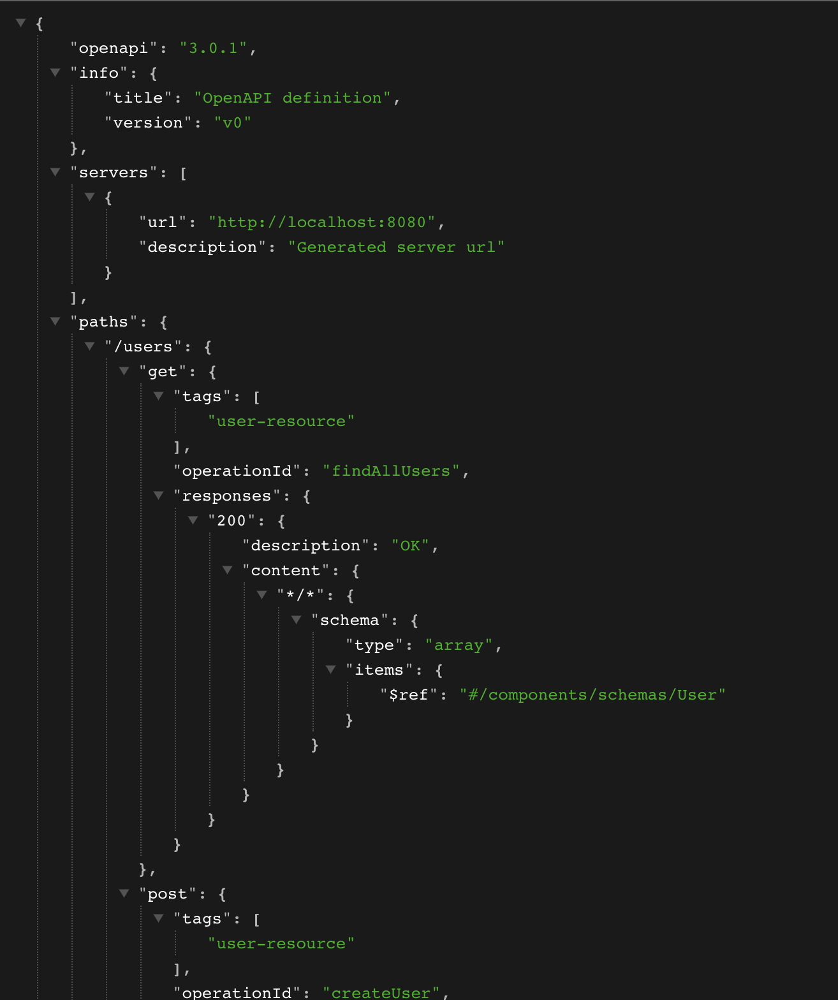
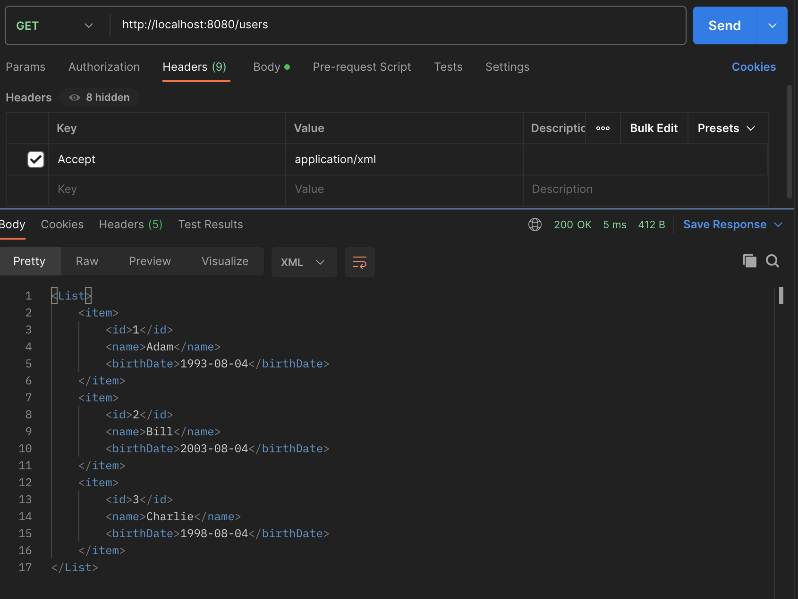
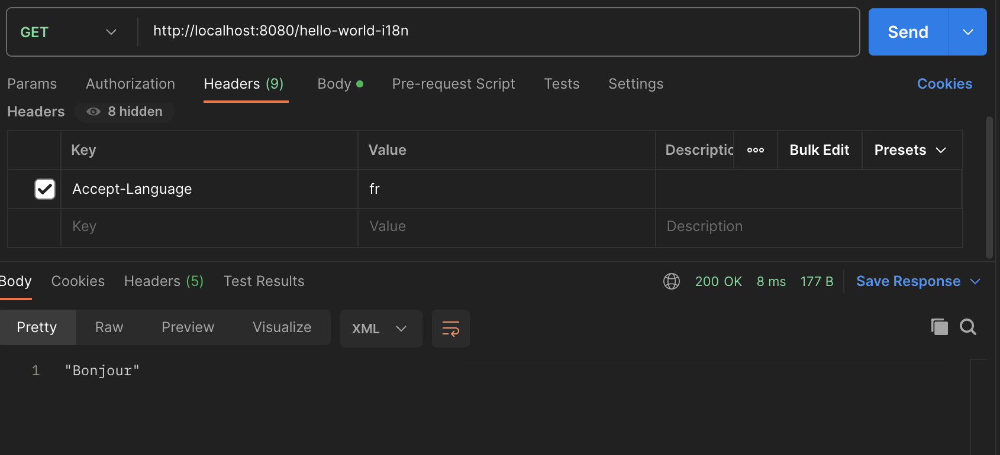

# 3. Java REST API 만들기 (2)

## REST API Documentation

내가 만든 REST API의 사용자들은 내 API가 어떤 리소스를 대상으로 하고, 어떤 동작을 수행하며, 요청/응답의 구조가 어떻게 짜여있는지 알 수 있어야 사용할 수 있을 것이다. 따라서 적절한 문서화는 굉장히 중요한 백엔드 개발자의 덕목이다. API 문서화의 핵심은 얼마나 정확하게 API를 표현하는지와 얼마나 일관성 있게 이를 유지하는지이다(API 갯수가 많아지면 패턴이나 스타일을 유지하기 힘들어지니까). 방법론으론 크게 직접 작성하는 방법과 코드로부터 문서를 생성하는 방법, 두가지로 나뉜다.

- Swagger & Open API
    - Swagger: 2011년에 명세와 툴이 출시되었다.
    - Open API: 2016년에 Swagger 명세에 기반하여 출시되었다. 현재 표준으로 여겨진다.
    - Swagger UI: REST API를 시각화하고 테스트 할 수 있다.
 
### Swager 자동 생성하기

build.gradle에 다음과 같은 의존성을 추가한다.
```groovy
dependencies {
    ...
    implementation 'org.springdoc:springdoc-openapi-starter-webmvc-ui:2.0.2'
    ...
}
```
그리고 앱을 실행한 후, localhost:8080/swagger-ui.html에 접속하면 자동으로 생성된 Swagger UI 페이지가 뜰 것이다. 이 사진에서 'OpenAPI definition'이라고 크게 써진 글씨 밑에 조그만 '/v3/api-docs'가 보일 것이다. 이를 클릭하면 OpenAPI 명세에 따른 JSON 문서를 확인할 수 있을 것이다.



---

## Content Negotiation

같은 API라도 상황에 따라 다른 언어나 다른 형식(JSON, XML 등)으로 반환해야 할 필요가 있다. 소비자의 니즈에 맞게 다른 형식으로 결과를 반환하는 것을 Content Negotiation이라고 한다. 이는 헤더에 넣는 값에 따라 구현할 수 있는데, 지금까지 JSON으로 반환했던 값들을 XML로 전환할 수 있도록 세팅해보자. 우선 build.gradle에 다음 의존성을 추가한다.
```groovy
dependencies {
    ...
    implementation 'com.fasterxml.jackson.dataformat:jackson-dataformat-xml'
    ...
}
```
그리고 앱을 실행 한 후, 헤더에 'Accept=application/xml'을 추가하고 GET localhost:8080/users을 호출해보자. XML로 출력되는 것을 알 수 있다. 'Accept=application/json'으로 설정하면 당연히 원래대로 JSON 형식으로 나온다. 


---

## Internationalization - i18n

국제 사용자를 위한 REST API를 제작할 때 신경써야 할 부분으로 Internationalization은 단어가 너무 기니까 보통 i18n이라고 줄여 표현한다. 이는 통상적으로 헤더에 Accept-Language 값을 세팅하는 것으로 구현한다. 예를 들어 en은 영어, nl은 네덜란드어, fr은 프랑스어를 표현한다.

예시를 위해 처음에 만들었던 HelloWorldController 클래스에 다음 메서드를 하나 더 추가하자. 이 메서드는 헤더의 Accept-Language 값에 따라 서로 다른 언어의 "Good Morning"을 반환하도록 한 메서드다. MessageSource 객체가 의존성으로 주입된 것을 볼 수 있고 이 클래스 객체의 getMessage 메서드를 호출하여 서로 다른 결과 값을 반환할 것이라는 것을 알 수 있다. 여기서 "good.morning.message"는 resources 디렉터리 안에 propeties 파일로 선언된 값이다.
```java
(HelloWorldController.java)

...

private MessageSource messageSource;

public HelloWorldController(MessageSource messageSource) {
    this.messageSource = messageSource;
}

@RequestMapping("/hello-world-i18n")
public String helloWorldI18n() {
    Locale locale = LocaleContextHolder.getLocale();
    return this.messageSource.getMessage("good.morning.message", null, "Default Message", locale);
}

...
```

src > main > resources > messages.properties 파일을 생성하고 이 안에 가장 기본이 되는 "good.morning.message" 값을 선언한다.
```properties
(messages.properties)
good.morning.message="Good Morning"
```

그리고 이어서 같은 위치에 message_nl.properties, message_fr.properties, message_de.properties 등과 같이 각 나라 코드에 맞는 파일을 생성한다. 이름은 'message_{국가코드}.properties'여야한다. 그리고 각각의 파일에 "good.morning.message"에 대한 각자의 값을 선언해주면 된다. 그럼 이대로 앱을 실행하고 포스트맨에서 테스트하면 다음과 같은 결과가 나올 것이다.




---

## 버전 관리

상황에 따라 API의 명세나 기능을 변경해야 할 때가 있다. 이미 배포된 서비스의 API를 맘대로 바꿀 순 없으니 버전 관리가 중요해질 수 밖에 없다. API의 버전을 나누는 법은 여러가지가 있다. 완벽한 방법은 없으며 상황에 따라 본인이 좋아하는 방법을 사용하면 된다.

- URI:
    - "/v1/users" 
    - "/v2/users"
- 파라미터
    - "/users?version=1"
    - "/users?version=2"
- 헤더
    - X-API-VERSION=1
    - X-API-VERSION=2
- Media Type(content negotiation or accept header)
    - procuces=application/vnd.company.app-v1+json
    - procuces=application/vnd.company.app-v2+json
    
---

## HATEOAS (Hypermedia as the Engine of Application State)

웹/앱 서비스는 API를 통해 유저에게 데이터를 제공하고 이에 대해 가능한 동작들을 제공한다. 하지만 단순히 동작 하나에서 끝나지 않고 그 이후에 이어질 동작까지 같이 제시한다면 이것을 HATEOAS라고 할 수 있다. 이는 직접 구현하는 방법도 있지만 유지/보수하기 어렵다. 보통은 HAL(JSON Hypertext Application Language)라 부르는 표준에 따라 구현한다. 이를 통해 리소스들 사이에 일관되고 알기 쉬운 하이퍼링크를 제공할 수 있다. HAL은 다음과 같이 생겼다. 

```json
{
    "name": "Adam",
    "birhtDate": "2022-02-02",
    "_links": {
        "all-users": {
            "href": "http://localhost:8080/users"
        }
    }
}
```

Spring에서 HATEOAS는 다음과 같은 의존성을 추가함으로써 간편하게 구현할 수 있는데, 필요하면 직접 찾아보고 구현할 것.
```groovy
implementation 'org.springframework.boot:spring-boot-starter-hateoas'
```

---

## 정적 필터링

직렬화(Serialization)란 객체를 스트림(JSON 등)으로 전환하는 과정이다. Java에서 가장 많이 쓰이는 JSON 직렬화 라이브러리는 Jackson이다. 지금까지 API에서 자동으로 JSON 변환이 일어나는 것이 다 Jackson 덕분이었다. 그리고 여기에 커스터마이징이 가능하다. 예를 들어 키의 이름을 변경하려면 @JsonProperty("{key_name}")와 같은 어노테이션을 붙여주면 된다.
```
@JsonProperty("user_name")
private String name;

// 원래 name으로 표시되던 키 이름이 user_name으로 바뀌어 반환된다.
```    

또한 반환된는 아이템의 리스트가 있을 경우, 이를 필터링하는 기능도 존재한다. 필터링에는 정적 필터링과 동적 필터링 두가지가 존재한다. 예시를 위해 다음과 같은 엔티티 클래스와 컨트롤러 클래스를 만들어보자.
```java
public class SomeBean {

    private String field1;
    private String field2;
    private String field3;
    
    ... // 생성자와 getter-setter를 구현했다고 가정
    
}

@RestController
public class FilteringController {

    @GetMapping("/filtering")
    public SomeBean filtering() {
        return new SomeBean("value1", "value2", "value3");
    }

    @GetMapping("/filtering-list")
    public List<SomeBean> filteringList() {
        return Arrays.asList(
            new SomeBean("value1", "value2", "value3"),
            new SomeBean("value4", "value5", "value6"),
            new SomeBean("value7", "value8", "value9")
        );
    }

}
```

이제 앱을 실행하고 localhost:8080/filtering에 접속하면 "value1", "value2", "value3"이 모두 뜰 것이다. 그런데 SomeBean에서 'field1' 필드에 대해 @JsonIgnore라는 어노테이션을 붙여보자.
```java
import com.fasterxml.jackson.annotation.JsonIgnore;

public class SomeBean {

    @JsonIgnore
    private String field1;
    private String field2;
    private String field3;
    
    ... // 생성자와 getter-setter를 구현했다고 가정
    
}

```
그럼 다시 실행했을 때, "value1"은 빠진 채로, "value2"와 "value3"만이 출력되는 것을 확인할 수 있을 것이다. 각각의 필드에 어노테이션을 붙이는 대신 @JsonIgnoreProperties 라는 어노테이션을 클래스 앞에 붙여서 여러 필드를 한꺼번에 필터링 할 수도 있다. 뿐만아니라, localhost:8080/filtering-list에 접속해도 "field1"에 해당하는 값들만 빠져서 출력되는 것을 확인할 수 있을 것이다. 이러한 동작을 정적 필터링이라고 한다. @JsonIgnore나 @JsonIgnoreProperties와 같은 어노테이션으로 구현하는 정적 필터링은 이처럼 어떤 상황에서든 특정 필드를 출력되지 않도록 해준다.

동적 필터는 기능은 동일하지만 구현 방법이 다르다. 위의 FilteringController 클래스의 getFiltering() 메서드를 다음과 같이 수정해보자.
```java
...
import com.fasterxml.jackson.databind.ser.FilterProvider;
import com.fasterxml.jackson.databind.ser.impl.SimpleBeanPropertyFilter;
import com.fasterxml.jackson.databind.ser.impl.SimpleFilterProvider;
import org.springframework.http.converter.json.MappingJacksonValue;

@RestController
public class FilteringController {

    @GetMapping("/filtering")
    public MappingJacksonValue filtering() {
        SomeBean someBean = new SomeBean("value1", "value2", "value3");
        MappingJacksonValue mappingJacksonValue = new MappingJacksonValue(someBean);
        SimpleBeanPropertyFilter filter = SimpleBeanPropertyFilter.filterOutAllExcept("field1", "field3");
        FilterProvider filters = new SimpleFilterProvider().addFilter("SomeBeanFilter", filter);
        mappingJacksonValue.setFilters(filters);
        return mappingJacksonValue;
    }
    
    ...
}
```

굉장히 많은 클래스들이 import되었지만 동작은 간단하다. 클래스나 필드에 정적으로 선언되어있던 필터 기능을 데이터를 반환할 시점에 구현하여, 원하는 타이밍에만 동작하도록 동적 속성을 부여한 것이다. 위 메서드는 "field1"과 "field3"만 반환되도록 필터링을 동적으로 추가한 것이다. 실행해보면 "field2" 값은 생략된 것을 확인할 수 있을 것이다. 그리고 동적 필터링이기에 수정되지 않은 localhost:8080/filtering-list API의 경우, 모든 필드가 완전히 출력되는 것도 확인할 수 있을 것이다.

---

## Spring Boot Actuator

Spring Boot Actuator는 동작중인 애플리케이션을 모니터링할 수 있게 해주는 라이브러리이다. 다음과 같이 의존성을 추가하자.
```groovy
(build.gradle)
...
dependencies {
    ...
    implementation 'org.springframework.boot:spring-boot-starter-actuator'
    ...
}
```

그리고 앱을 실행한 후, localhost:8080/actuator에 접속하면 다음과 같은 JSON을 볼 수 있을 것이다. href에 있는 링크를 타고 들어가면 각각의 항목에 대한 세부 정보를 확인할 수 있다. 기본적으론 아래와 같이 3개의 항목만 있지만 application.properties에 설정을 바꿔주면 모니터링 항목을 늘릴 수 있다. application.properties에 'management.endpoints.web.exposure.include=*' 한줄을 추가하면 모든 항목을 확인할 수 있다.
```json
{
    "_links": {
        "self": {
            "href": "http://localhost:8080/actuator",
            "templated": false
        },
        "health": {
            "href": "http://localhost:8080/actuator/health",
            "templated": false
        },
        "health-path": {
            "href": "http://localhost:8080/actuator/health/{*path}",
            "templated": true
        }
    }
}
```
 

Spring Boot Actuator는 다양한 엔드포인트를 제공하는데, 대표적으로 beans, health, metrics, mappings가 있다.
- beans: 앱 내의 모든 Spring Bean의 정보를 조회
- health: 앱의 구동 상태 정보
- metrics: 
- mappings: 리퀘스트 맵핑 관련된 정보
