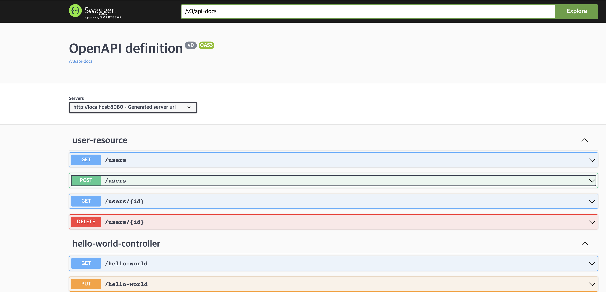

# 3. Java REST API 만들기 (2)

## REST API Documentation

내가 만든 REST API의 사용자들은 내 API가 어떤 리소스를 대상으로 하고, 어떤 동작을 수행하며, 요청/응답의 구조가 어떻게 짜여있는지 알 수 있어야 사용할 수 있을 것이다. 따라서 적절한 문서화는 굉장히 중요한 백엔드 개발자의 덕목이다. API 문서화의 핵심은 얼마나 정확하게 API를 표현하는지와 얼마나 일관성 있게 이를 유지하는지이다(API 갯수가 많아지면 패턴이나 스타일을 유지하기 힘들어지니까). 방법론으론 크게 직접 작성하는 방법과 코드로부터 문서를 생성하는 방법, 두가지로 나뉜다.

- Swagger & Open API
    - Swagger: 2011년에 명세와 툴이 출시되었다.
    - Open API: 2016년에 Swagger 명세에 기반하여 출시되었다. 현재 표준으로 여겨진다.
    - Swagger UI: REST API를 시각화하고 테스트 할 수 있다.
 
### Swager 자동 생성하기

build.gradle에 다음과 같은 의존성을 추가한다.
```groovy
dependencies {
    ...
    implementation 'org.springdoc:springdoc-openapi-starter-webmvc-ui:2.0.2'
    ...
}
```
그리고 앱을 실행한 후, localhost:8080/swagger-ui.html에 접속하면 자동으로 생성된 Swagger UI 페이지가 뜰 것이다. 이 사진에서 'OpenAPI definition'이라고 크게 써진 글씨 밑에 조그만 '/v3/api-docs'가 보일 것이다. 이를 클릭하면 OpenAPI 명세에 따른 JSON 문서를 확인할 수 있을 것이다.



---

## Content Negotiation

같은 API라도 상황에 따라 다른 언어나 다른 형식(JSON, XML 등)으로 반환해야 할 필요가 있다. 소비자의 니즈에 맞게 다른 형식으로 결과를 반환하는 것을 Content Negotiation이라고 한다. 이는 헤더에 넣는 값에 따라 구현할 수 있는데, 지금까지 JSON으로 반환했던 값들을 XML로 전환할 수 있도록 세팅해보자. 우선 build.gradle에 다음 의존성을 추가한다.
```groovy
dependencies {
    ...
    implementation 'com.fasterxml.jackson.dataformat:jackson-dataformat-xml'
    ...
}
```
그리고 앱을 실행 한 후, 헤더에 'Accept=application/xml'을 추가하고 GET localhost:8080/users을 호출해보자. XML로 출력되는 것을 알 수 있다. 'Accept=application/json'으로 설정하면 당연히 원래대로 JSON 형식으로 나온다. 


---

## Internationalization - i18n

국제 사용자를 위한 REST API를 제작할 때 신경써야 할 부분으로 Internationalization은 단어가 너무 기니까 보통 i18n이라고 줄여 표현한다. 이는 통상적으로 헤더에 Accept-Language 값을 세팅하는 것으로 구현한다. 예를 들어 en은 영어, nl은 네덜란드어, fr은 프랑스어를 표현한다.

예시를 위해 처음에 만들었던 HelloWorldController 클래스에 다음 메서드를 하나 더 추가하자. 이 메서드는 헤더의 Accept-Language 값에 따라 서로 다른 언어의 "Good Morning"을 반환하도록 한 메서드다. MessageSource 객체가 의존성으로 주입된 것을 볼 수 있고 이 클래스 객체의 getMessage 메서드를 호출하여 서로 다른 결과 값을 반환할 것이라는 것을 알 수 있다. 여기서 "good.morning.message"는 resources 디렉터리 안에 propeties 파일로 선언된 값이다.
```java
(HelloWorldController.java)

...

private MessageSource messageSource;

public HelloWorldController(MessageSource messageSource) {
    this.messageSource = messageSource;
}

@RequestMapping("/hello-world-i18n")
public String helloWorldI18n() {
    Locale locale = LocaleContextHolder.getLocale();
    return this.messageSource.getMessage("good.morning.message", null, "Default Message", locale);
}

...
```

src > main > resources > messages.properties 파일을 생성하고 이 안에 가장 기본이 되는 "good.morning.message" 값을 선언한다.
```properties
(messages.properties)
good.morning.message="Good Morning"
```

그리고 이어서 같은 위치에 message_nl.properties, message_fr.properties, message_de.properties 등과 같이 각 나라 코드에 맞는 파일을 생성한다. 이름은 'message_{국가코드}.properties'여야한다. 그리고 각각의 파일에 "good.morning.message"에 대한 각자의 값을 선언해주면 된다. 그럼 이대로 앱을 실행하고 포스트맨에서 테스트하면 다음과 같은 결과가 나올 것이다.


