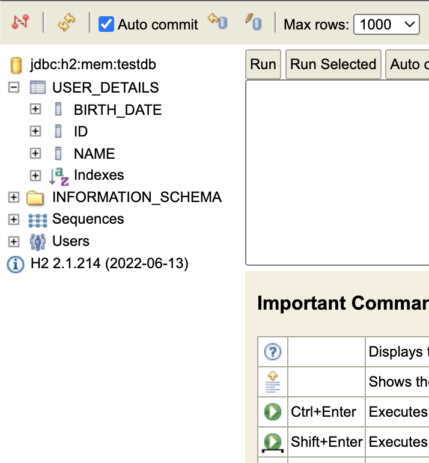
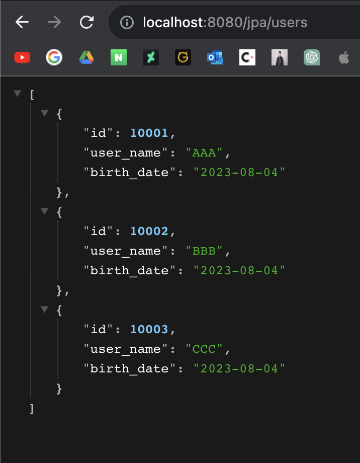
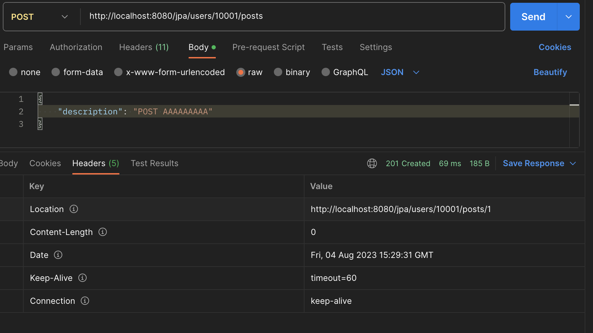

# 3. Java REST API 만들기 (3)

## JPA & Hibernate를 이용해 H2 연결

우선 User 클래스를 엔티티로 만들자. User 클래스 이름 앞에 @Entity 어노테이션을 붙이고 프라이머리 키인 int id 앞에 @Id, @GeneratedValue 어노테이션을 붙이자. 그리고 앱을 실행하면 자동으로 User 엔티티가 생성될 것이다. 다만, USER라는 테이블 이름은 예약된 값이기 때문에 다른 이름을 지정해줘야한다. @Entity(name = "user_detail")과 같이 별도의 이름을 부여해주자.

```java
@Entity(name = "user_details")
public class User {

    @Id
    @GeneratedValue
    private int id;
    
    ...
}
```

앱을 실행하고 localhost:8080/h2-consle에 접속하면 USER_DETAILS라는 테이블 스키마가 만들어져 있는 것을 확인할 수 있을 것이다.


그리고 데이터를 초기화하기 위해 src > main > resources에 data.sql 파일을 만들고 최초 데이터를 넣는 SQL을 입력하자.
```sql
insert into user_details (id, name, birth_date)
values (10002, 'BBB', current_date());

insert into user_details (id, name, birth_date)
values (10001, 'AAA', current_date());

insert into user_details (id, name, birth_date)
values (10003, 'CCC', current_date());
```

이대로 실행을 하면 에러가 날 것이다. 아직 스키마만 있고 테이블이 생성되지 않은 상황에서 데이터를 추가하려했기 때문이다. 그래서 데이터를 추가할 때, 테이블이 없을 시 테이블을 만드는 설정을 application.properties에 추가하도록 하자.
```
(application.properties)
...
spring.jpa.defer-datasource-initialization=true
...
```

이제 초기 세팅은 완료됐다. 다음으로 기존 UserDao를 대체할 UserRepository 인터페이스를 만들어야 한다. 이 인터페이스는 JpaRespository<T, N> 이라는 인터페이스를 상속했으며 대부분의 데이터 쿼리 기능이 미리 선언되어있다. 따라서 UserRepository 역시 추가적인 메서드를 선언할 필요가 없다.
```
import com.ade.restfullwebservices.user.User;
import org.springframework.data.jpa.repository.JpaRepository;

public interface UserRepository extends JpaRepository<User, Integer> {}
```

다음으로 기존의 UserResponse를 복사하여 UserJpaResource를 만든다. 그리고 조금 수정을 하여 데이터 소스만 H2 데이터베이스로 바꾸는 작업을 하자. UserJpaResource는 다음과 같다. UserRepository 객체를 의존성 주입받고 있으며 기존의 UserDaoService는 사라졌다.
```java
@RestController
public class UserJpaResource {

    private final UserRepository userRepository;

    public UserJpaResource(UserRepository userRepository) {
        this.userRepository = userRepository;
    }
    ...
}
``` 

이제 UserDaoService가 사라졌으니 UserRepository가 그 자리를 대신해야 한다. UserRepository에는 findAll(), findById(int), save(User), deleteById(int) 등의 기본적인 쿼리 메서드가 미리 선언되어있기 때문에 여기서 호춣만 적절하게 해주면 된다. 최종적으로 UserJpaResource는 다음과 같은 메서드들을 가지게 될 것이다. 앱을 실행해보면 기존과 동일한 결과를 확인할 수 있을 것이다. 다만 H2 데이터베이스에 있는 리소스를 가져오므로 반환되는 데이터가 조금 다를 것이다.
```java
    @GetMapping("/jpa/users")
    public List<User> findAllUsers() {
        return this.userRepository.findAll();
    }

    @GetMapping("/jpa/users/{id}")
    public EntityModel<User> findUserById(@PathVariable int id) throws UserNotFoundException {
        Optional<User> user = this.userRepository.findById(id);
        if (user.isEmpty()) {
            throw new UserNotFoundException("id: "+id);
        }
        EntityModel<User> entityModel = EntityModel.of(user.get());
        WebMvcLinkBuilder link = WebMvcLinkBuilder.linkTo(WebMvcLinkBuilder.methodOn(this.getClass()).findAllUsers());
        entityModel.add(link.withRel("all-users"));
        return entityModel;
    }

    @PostMapping("/jpa/users")
    public ResponseEntity<User> createUser(@Valid @RequestBody User user) {
        User savedUser = this.userRepository.save(user);
        URI location = ServletUriComponentsBuilder.fromCurrentRequest()
                .path("/{id}")
                .buildAndExpand(savedUser.getId())
                .toUri();
        return ResponseEntity.created(location).build();
    }

    @DeleteMapping("/jpa/users/{id}")
    public void deleteUser(@PathVariable int id) {
        this.userRepository.deleteById(id);
    }
```



---

## One-to-Many 관계 생성

이제 Post 엔티티를 만들어 볼 것이다. User와 Post는 일대다관계이다. 하나의 Post에 대응되는 User는 하나이지만, 하나의 User에 대응되는 Post는 다수가 될 수 있다. 이 관계를 Spring Boot에서 어노테이션을 통해 정의할 수 있다. 우선 Post 클래스는 다음과 같다.
```java
@Entity
public class Post {

    @Id
    @GeneratedValue
    private int id;

    private String description;

    @ManyToOne(fetch = FetchType.LAZY)
    @JsonIgnore
    private User user;

    ...
}
```

User와 별 다를게 없지만 @ManyToOne 이라는 어노테이션이 눈에 띈다. 하나의 Post는 하나의 User를 가지므로 Post 크래스는 User 타입 객체 하나를 가지고, 이는 Many(Post) to One(User) 관계로 정의되는 것이다. 그리고 파라미터로 주어진 FetchType.LAZY는 API에서 Post 데이터를 다룰 때, User의 모든 데이터를 사용하지는 않겠다는 의미이다. 즉, User의 Primary Key만 참조하고 다른 User의 모든 데이터를 일일히 표시하진 않는다는 뜻이다. 그 반대는 FetchType.EAGER로 설정하면 된다.

여기서 끝날 게 아니라 User 클래스도 데이터와 어노테이션 추가가 필요하다. 다음과 같이 하나의 User는 0개 이상의 Post를 가질 수 있으므로 User 클래스는 List<Post> 객체를 가진다. 그리고 아까 Post와는 반대로, One(User) to Many(Post)의 관계를 가지며 @OneToMany 어노테이션의 파라미터로 mapped="user"가 들어가는데, 이는 이 관계의 주체가 User라는 의미이다. 그리고 @JsonIgnore로 설정되었기에 실제로 User 데이터를 불러오는 API에서 Post 데이터는 보여지지 않을 것이다.
```java
(User.java)
...

@OneToMany(mappedBy = "user")
@JsonIgnore
private List<Post> posts;

...
```

---

## POST 메서드 구현

제일 먼저 PostRepository를 선언해야 한다. 간단하다.
```java
public interface PostRepository extends JpaRepository<Post, Integer> { }
```

이제 PostRepository에 대한 의존성을 UserResource에 주입해준다.
```java
@RestController
public class UserJpaResource {

    private final UserRepository userRepository;
    private final PostRepository postRepository;

    public UserJpaResource(UserRepository userRepository, PostRepository postRepository) {
        this.userRepository = userRepository;
        this.postRepository = postRepository;
    }
    
    ...
    
}
```

이제 실제 API를 구현해보자. 먼저, User의 아이디를 받고 해당 유저의 모든 Post를 반환하는 API는 다음과 같다.
```java
@GetMapping("/jpa/users/{id}/posts")
public List<Post> findAllPosts(@PathVariable int id) {
    Optional<User> user = this.userRepository.findById(id);
    if (user.isEmpty()) {
        throw new UserNotFoundException("id: "+id);
    }
    return user.get().getPosts();
}
```

다음으로 User의 아이디와 Post의 내용을 받아 새로운 Post를 생성하는 API는 다음과 같다.
```java
@PostMapping("/jpa/users/{id}/posts")
public ResponseEntity<Object> createPost(@PathVariable int id, @Valid @RequestBody Post post) {
    Optional<User> user = this.userRepository.findById(id);
    if (user.isEmpty()) {
        throw new UserNotFoundException("id: "+id);
    }
    post.setUser(user.get());
    Post savedPost = this.postRepository.save(post);
    URI location = ServletUriComponentsBuilder.fromCurrentRequest()
            .path("/{id}")
            .buildAndExpand(savedPost.getId())
            .toUri();
    return ResponseEntity.created(location).build();
}
```
POST API를 수행하고 응답 헤더에 Location을 확인하자. 만들어진 Post의 주인이 되는 User의 리소스 주소가 들어가도록 하였다. 

