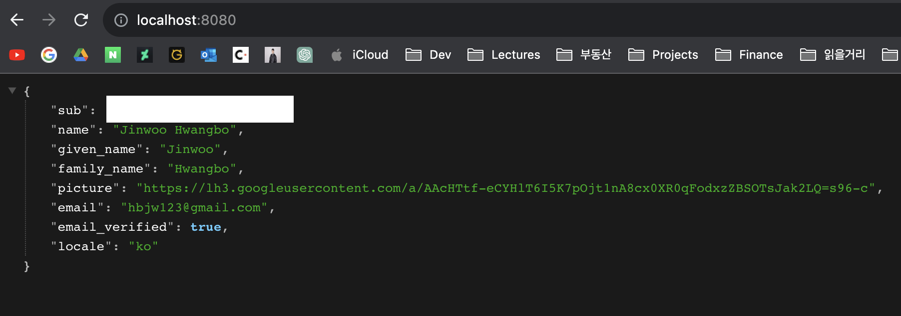

# 구글 로그인 구현

참고: https://developers.google.com/identity/openid-connect/openid-connect

## 구글 클라우드 설정

1. [구글 클라우드 콘솔](https://console.cloud.google.com/)에 접속한다.

2. 프로젝트가 없으면 프로젝트를 만든다.

3. ['API 및 서비스'](https://console.cloud.google.com/apis/dashboard) 탭을 선택한다.

4. '사용자 인증 정보'를 선택한다.

5. '+ 사용자 인증 정보 만들기' > 'OAuth 클라이언트 ID'를 선택한다.

6. 애플리케이션 유형은 '웹 애플리케이션'으로 선택.

7. 애플리케이션 이름은 대충 입력하고 '승인된 리디렉션 URI'에 'localhost:8080/login/oauth2/code/google'을 입력한다.

8. '만들기'를 누르면 '클라이언트 ID'와 '클라이언트 보안 비밀번호'가 생성된 것을 확인할 수 있다.

---

## 인증 과정

구글 클라우드가 설정되었으면 이제부터 다음과 같은 프로토콜을 따라 사용자 인증을 구현하게 될 것이다.

1. **위조 방지 상태 토큰(anti-forgery state token)을 생성한다.**
    
    위조 방지 상태 토큰이란 요청 위조 공격을 방지하기 위한 앱 서비스와 유저간의 상태를 나타내는 유일한 세션 토큰이다. 추후에 구글의 인증 응답값과 이 토큰 값을 대조하며 올바른 유저가 요청을 한 것인지 판단하게 된다. 이 토큰을 흔히 CSRF(cross-site request forgery)토큰이라고 한다. 이 토큰은 보통 고성능 난수 생성기를 이용해 뽑아낸 30자 이상의 문자열을 사용하거나 특정한 상태 변수 값을 백엔드에 저장된 비밀키로 해시한 값을 사용하기도 한다. 다음은 Java로 세션 토큰을 만들어내는 예시이다.
    
2. **구글에 인증 요청을 보낸다.**

    구글에서 제공하는 'Discovery document'라는 JSON 파일이 있다. 이는 다음 URI에 HTTPS GET 요청으로 받을 수 있다.
    
    > https://accounts.google.com/.well-known/openid-configuration
    
    이 JSON 문서엔 'authorization_endpoint'라는 키를 가지는 URI가 있는데, 이 URI로 구글에 인증 요청을 날리게 될 것이다. 요청에 들어갈 파라미터는 다음과 같다.
    
    - client_id: (필수) 아까 구글 클라우드를 설정하면서 만든 클라이언트 ID 값이다.
    - response_type: (필수) "code"를 사용한다.
    - scope: (필수) 반환받을 이용자 정보의 범위이다. "openid email"이 기본이다.
    - redirect_uri: (필수) 이 요청에 대한 응답을 받을 URI이다.
    - state: (선택이지만 필수 권장) 1번에서 생성한 위조 방지 상태 토큰이다.
    - nonce: (필수) 리플레이 공격을 방지하기 위한 랜덤 값이다.
    - 이외 여러가지 선택 항목들이 있는데 [여기](https://developers.google.com/identity/openid-connect/openid-connect#authenticationuriparameters)서 확인하자.
    
    결과적으로 다음과 같은 요청을 authorization_endpoint로 날리게 될 것이다.
    
    ```
    https://accounts.google.com/o/oauth2/v2/auth?
        response_type=code&
        client_id=424911365001.apps.googleusercontent.com&
        scope=openid%20email&
        redirect_uri=https%3A//oauth2.example.com/code&
        state=security_token%3D138r5719ru3e1%26url%3Dhttps%3A%2F%2Foauth2-login-demo.example.com%2FmyHome&
        login_hint=jsmith@example.com&
        nonce=0394852-3190485-2490358&
        hd=example.com
    ```

3. **위조 방지 상태 토큰을 검증한다.**

    구글로부터 redirect_uri로 전달받은 응답이 다음과 같이 쿼리 파라미터에 담겨 올 것이다.
    
    ```
    https://oauth2.example.com/code?
        state=security_token%3D138r5719ru3e1%26url%3Dhttps%3A%2F%2Foa2cb.example.com%2FmyHome&
        code=4/P7q7W91a-oMsCeLvIaQm6bTrgtp7&
        scope=openid%20email%20https://www.googleapis.com/auth/userinfo.email
    ``` 
    
    여기서 'state'에 해당하는 값이 앞서 요청에 담아 보냈던 위조 방지 상태 토큰과 같은지 검증한다. 이를 통해 올바른 이용자가 보낸 응답임을 확인할 수 있다.

4. **code를 액세스 토큰/ID 토큰과 교환한다.**

    응답에서 받은 'code' 값이 있을 것이다. 이는 액세스 토큰 및 ID 토큰과 교환할 수 있는 일회성 코드이다. 이 교환은 HTTPS POST 요청을 통해 이뤄진다. 요청을 보낼 주소는 아까 언급한 'Discovery document'의 'token_endpoint' 항목에서 얻을 수 있다. 리퀘스트 바디에는 다음과 같은 항목들이 담길 것이다.
    
    - code: 2번에서 받아온 code 값.
    - client_id: 아까 구글 클라우드를 설정하면서 만든 '클라이언트 ID' 값.
    - client_secret: 아까 구글 클라우드를 설정하면서 만든 '클라이언트 보안 비밀번호' 값.
    - redirect_uri: 이 요청에 대한 응답을 받을 URI.
    - grant_type: "authorization_code"
    
    결과적으로 다음과 같은 요청을 보내게 될 것이다.
    
    ```
    POST /token HTTP/1.1
    Host: oauth2.googleapis.com
    Content-Type: application/x-www-form-urlencoded

    code=4/P7q7W91a-oMsCeLvIaQm6bTrgtp7&
    client_id=your-client-id&
    client_secret=your-client-secret&
    redirect_uri=https%3A//oauth2.example.com/code&
    grant_type=authorization_code
    ```
    
    그리고 이에 대한 응답은 redirect_uri를 통해 다음과 같은 형식의 JSON 배열로 받을 수 있을 것이다.
    
    - access_token: 액세스 토큰.
    - expires_in: 액세스 토큰 유효 기간. 초단위로 한다.
    - id_token: ID 토큰. 사용자에 대한 정보와 구글의 서명을 담고있는 JWT이다.
    - scope: 액세스 토큰이 가진 권한의 범위.
    - token_type: "Bearer"
    - refresh_token: (선택) 2번의 인증 요청에서 "access_type" 필드가 "offline"로 설정하였을 경우 받을 수 있다. 

5. **ID 토큰으로부터 사용자 정보를 획득한다.**

    ID 토큰은 사용자에 대한 정보와 구글의 서명을 담은 JWT라고 하였다. 이 토큰의 페이로드를 디코딩하면 다음과 같을 것이다.
    
    ```json
    {
      "iss": "https://accounts.google.com",
      "azp": "1234987819200.apps.googleusercontent.com",
      "aud": "1234987819200.apps.googleusercontent.com",
      "sub": "10769150350006150715113082367",
      "at_hash": "HK6E_P6Dh8Y93mRNtsDB1Q",
      "hd": "example.com",
      "email": "jsmith@example.com",
      "email_verified": "true",
      "iat": 1353601026,
      "exp": 1353604926,
      "nonce": "0394852-3190485-2490358"
    }
    ```
    
    각 필드들을 'claim'이라고 하는데, 각 claim에 대한 설명은 다음과 같다.
    - aud: (필수) 해당 ID 토큰을 사용할 대상(audience). OAauth 2.0 클라이언트 ID 중 하나여야 한다.
    - exp: (필수) 유효기간
    - iat: (필수) 발급시간
    - iss: (필수) 토큰 발행자. https://accounts.google.com 혹은 accounts.google.com 중 하나이다.
    - sub: (필수) 사용자의 고유 식별자. 애플리케이션에서 유저를 식별하기 위한 용도로 사용하면 된다. 최대 255자의 대소문자 구분 있는 아스키 문자로 구성되어있다.
    - 그외 많은 선택 클레임들이 있고 이는 [여기](https://developers.google.com/identity/openid-connect/openid-connect#an-id-tokens-payload)서 확인하자.

6. **사용자를 인증한다.**

ID 토큰에서 받은 정보를 바탕으로 이용자를 식별하고 로그인 혹은 회원가입 처리를 한다.

---

## 스프링 부트 프로젝트 설정

스프링 부트 프로젝트에 다음과 같은 의존성을 추가한다.
```groovy
dependencies {
    ...
    implementation 'org.springframework.boot:spring-boot-starter-web'
    implementation 'org.springframework.boot:spring-boot-starter-security'
    implementation 'org.springframework.boot:spring-boot-starter-oauth2-client'
    ...
}
``` 

application.properties에 다음과 같은 설정을 추가한다.
```
spring.security.oauth2.client.registration.google.client-id={클라이언트 ID}
spring.security.oauth2.client.registration.google.client-secret={클라이언트 보안 비밀번호}
```

컨트롤러 클래스를 하나 만들고 다음과 같은 REST API 하나를 생성한다.
```java
@RestController
public class GoogleController {

    @GetMapping
    public Object getCurrentUser(OAuth2AuthenticationToken oAuth2AuthenticationToken) {
        return oAuth2AuthenticationToken
            .getPrincipal()
            .getAttributes();
    }

}
```

앱을 실행시키고 localhost:8080에 접속하면 구글 로그인 화면이 뜰 것이다. 구글 로그인읋 해주고나면 다음과 같은 결과를 확인할 수 있을 것이다.

