# Spring Security


## 보안의 기초

어떠한 시스템에서든, 사용자는 자원을 가지고 있고 신원을 가지고 있다.
    - 자원: REST API, 어플리케이션, 데이터베이스 등
    - 신원: 자원에 접근하여 동작을 취하는 주체
그렇다면 다음과 같은 핵심적인 문제가 발생한다.
    ***어떻게 사용자를 식별할 것인가***
    ***어떻게 사용자에 따라 자원과 동작에 대한 접근을 구성할 것인가***
이러한 문제에 대한 대응이 각각 **인증(Authentication)**과 **인가(Authorization)**이다.

---

## 보안의 원칙

어떠한 보안의 강도는 가장 약한 부분의 강도와도 같다. 작은 결함도 전체 시스템을 망가뜨릴 수 있다.
안전한 시스템의 6가지 법칙
- 아무것도 믿지마라
- 최소한의 권한만 제공하라
- 완전한 중간지대를 만들어라
- 보안을 여러 레이어로 구현하라
- 최대한 간결하게 하라
- 개방성을 고려하라  

---

## Spring Security

Spring MVC는 다음과 같은 구조로 동작한다.

> REQUEST -> DISPATCHER SERVLET -> CONTROLLER(S)

스프링 애플리케이션으로 오는 모든 요청은 먼저 Dispatcher Servlet으로 간다. Dispatcher Servlet는 일종의 최초의 컨트롤러로서 작동하며, 최종 컨트롤러로 적절하게 라우팅하는 역할을 수행한다. 그런데 Spring Security를 도입하면 여기에 레이어가 하나 더 추가된다.

> REQUEST -> SPRING SECURITY -> DISPATCHER SERVLET -> CONTROLLER(S)

Spring Security가 Dispatcher Servlet에 앞서 모든 요청을 인터셉트한다. 그리고 들어오는 모든 요청에 대해 인증과 인가에 관한 처리를 선제적으로 수행한다.

Spring Security는 서로다른 기능을 제공하는 연속된 필터에 의해 동작한다.
    - Authentication: 유효한 유저인지 판단
    - Authorization: 적절한 권한을 갖춘 유저인지 판단
    - CorsFilter: Cross-Origin Resource Sharing(CORS)
    - CsrfFilter: Cross-Site Request Forgery(CSRF)
    - LogoutFilter, DefaultLoginPageGeneratingFilter, DefaultLogoutPageGeneratingFilter: 기본 로그인/로그아웃 페이지
    - ExceptionTranslationFilter: 발생하는 예외를 적절한 HTTP 응답으로 변환
필터의 순서는 매우 중요하며 크게 다음 순서로 구성한다.
    1. 기본 필터(CORS, CSRF 등)
    2. 인증 필터
    3. 인가 필터
    
---
    
## Authentication/Authorization Filter - 모든 것이 인증된다.

Spring Security 의존성(org.springframework.boot:spring-boot-starter-security)을 추가하고 앱을 실행하면 어떤 경로를 브라우저 창에 입력하더라도 기본 로그인 페이지가 뜨게된다.  
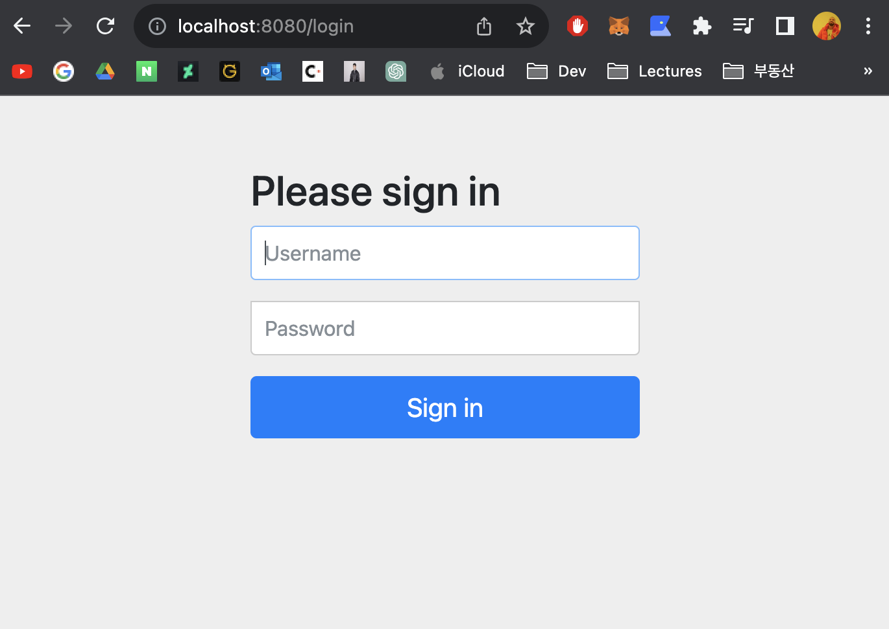
 이로써 기본적으로 모든 리소스가 인증을 요구하도록 보호받게된다. 심지어 앱에서 정의하지 않은 경로도 같은 보호를 받는다. 인증을 하기 전엔 이 앱이 어떤 리소스를 제공하는지 유추도 할 수 없도록 하기 위함이다. 위에서 설명한 6가지 보안 원칙 중 3번째, '완전한 중간지대를 만들어라'가 이런 의미이다. 인증 필터를 통해 로그인 페이지라는 중간지대를 만들어 앱의 리소스를 1차적으로 보호하는 것이다.

이러한 인증 과정을 'form-based authentication'이라고 하는데 대부분의 웹 어플리케이션들이 적용하고 있는 것이다. 로그인을 하면 세션 쿠키가 생성이 되고 이후 일어나는 모든 요청에 이 세션 쿠키를 포함하게 된다. 로그인 페이지와 로그아웃 페이지를 포함하며 /logout URL을 제공한다.

참고로 아무런 설정이 없는 기본 상태에서 로그인 하려면 ID에는 user, Password에는 콘솔 창에 뜬 일시적 비밀번호를 찾아 입력하면 된다.
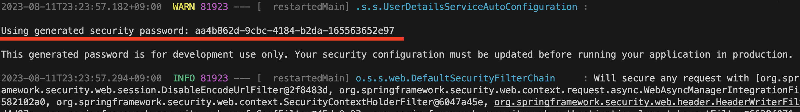 

로그인을 한 후, 어떤 요청을 하고 결과를 성공적으로 받는다. 그리고 브라우저 개발자 도구 창을 열어 해당 요청에 대한 로그를 보면 헤더에 세션 쿠키 값이 있는 것을 확인할 수 있다.
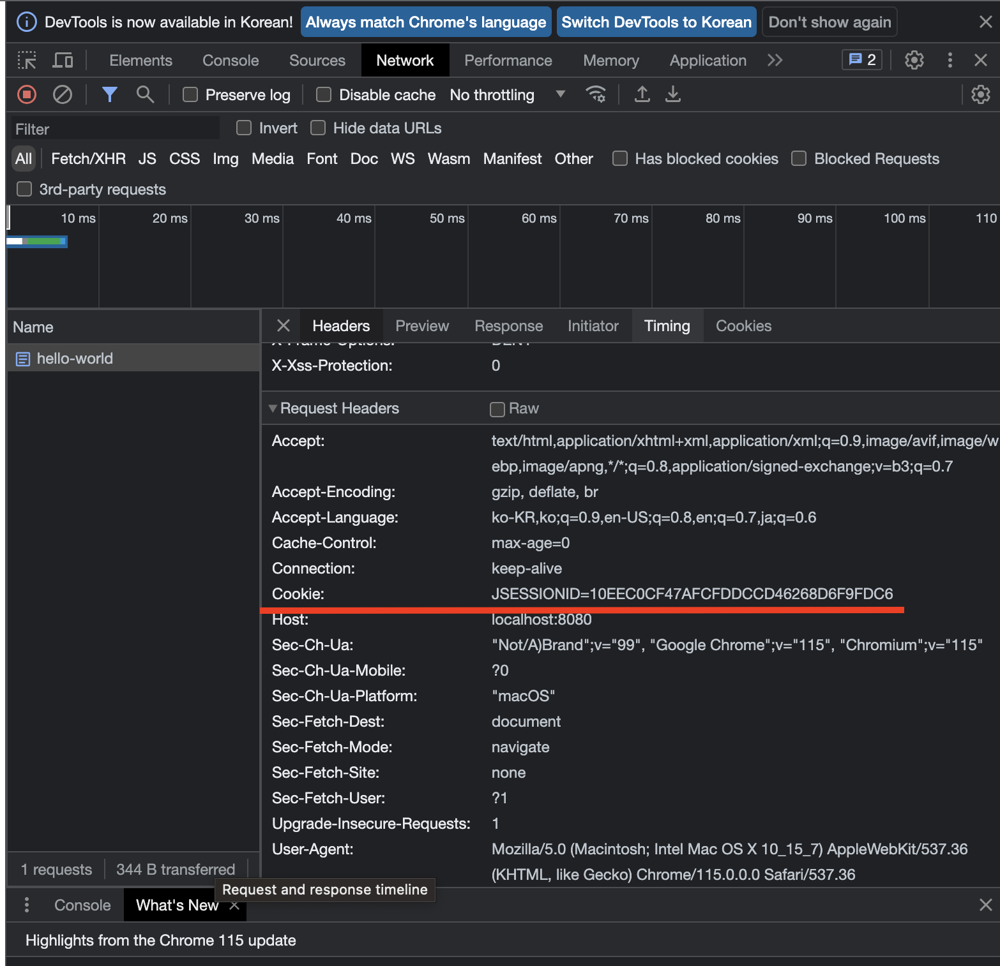

그리고 /logout 경로에 접속하면 이렇게 기본 로그아웃 페이지가 나타난다. 로그아웃 버튼을 누르면 다시 로그인 화면으로 돌아가게 된다.
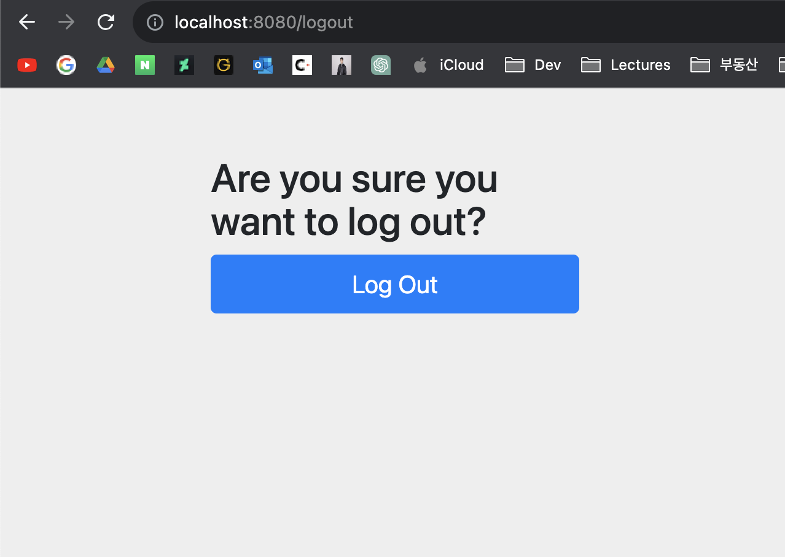 

브라우저가 아닌 다른 환경에서 API를 호출하면 로그인 페이지가 없으므로 다른 방법을 통해 인증을 하게된다. 예를들어 아이디를 "ade", 패스워드를 "haha" 라고 설정했다고 하자. 참고로 그러한 설정은 application.properties에서 다음과 같이 할 수 있다.
```
spring.security.user.name=ade
spring.security.user.password=haha
```
그리고 이 상태에서 {ID}:{PASSWORD} 형식의 스트링을 Base64로 인코딩한다. 즉, "ade:haha"를 Base64로 인코딩하여 "YWRlOmhhaGE="와 같은 스트링을 만드는 것이다. 그리고 이것을 HTTP 요청 헤더에 Authorization 필드에 "Basic YWRlOmhhaGE=" 처럼 넣어주면 로그인 한 것과 같은 효과를 발휘할 것이다. 포스트맨에서 친절하게 'Basic Auth'라는 기능을 통해 바로 이 것을 구현해준다.
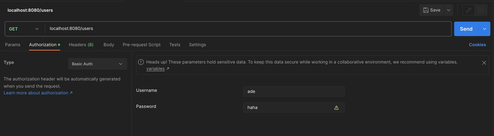
이렇게 아이디와 패스워드를 입력하고 요청을 날리면
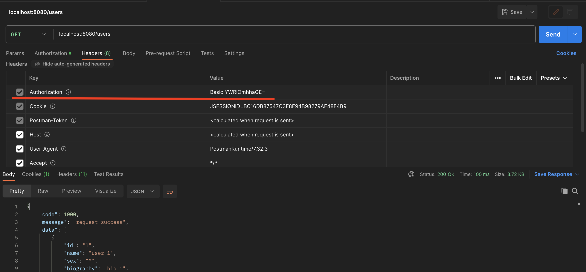
이처럼 "Authorization" 필드에 Base64 스트링이 들어가고 성공적으로 응답을 받아오는 것을 확인할 수 있다.

다만 이렇게 Spring Security가 기본적으로 제공하는 인증 필터는 편리하지만 너무나도 간단하고 원시적이기에 실제 서비스에선 쓰이지 않는다.

---

## CSRF Filter - CSRF 공격을 막기 위해

은행 웹사이트에 접속하여 세션 쿠키가 브라우저에 저장되었다. 그리고 로그아웃을 하지 않은채로 어떤 악의적인 웹사이트에 접속했다. 그러면 그 웹사이트는 세션 쿠키를 이용해 내 계좌에서 이체를 수행할 수 있다. 이러한 행위를 CSRF, Cross-Site Request Forgery라고 한다.

CSRF를 예방하는 방법은 여러가지가 있는데 Spring Security에 기본 적용된 것은 'CSRF 토큰'이다. API 요청이 이뤄질 때 마다 각각 다른 토큰을 생성한다. 그리고 새로운 API 동작을 수행할 때 마다 이전 동작에서 발생한 토큰을 요구하도록 한다. 만약 이 토큰이 이미 사용된 것이거나 전혀 다른 값이면 CSRF로 간주하여 에러를 반환한다. 예를들어 '/logout' 페이지의 소스를 살펴보자.
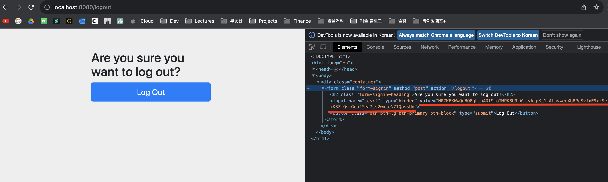

"name"이 "_csrf"라고 되어있는 태그에 "value"로 임의의 긴 문자열이 들어가있다. 이것이 이전 API 요청에서 발생한 CSRF 토큰이다. 만약 이 값이 없거나 적절하지 않은 값으로 바뀌면 로그아웃 버튼을 눌러도 에러만 반환될 것이다.  

CSRF 토큰은 다음과 같이 확인할 수 있다.
```java
...
@GetMapping("csrf-token")
public CsrfToken getCSRFToken(HttpServletRequest request) {
    return (CsrfToken) request.getAttribute("_csrf");
}
...
``` 
위와 같은 API를 만들고 '/csrf-token'에 접속하면 다음과 같은 화면을 볼 수 있다.
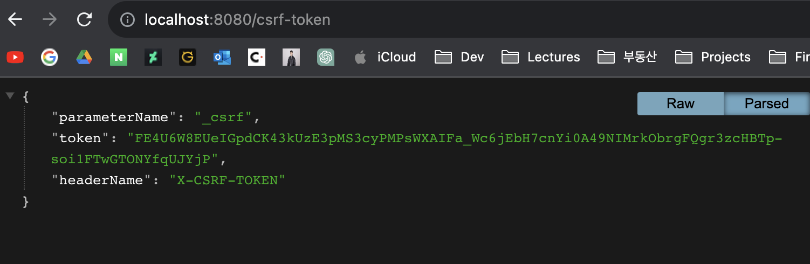

"token"에 해당하는 값은 당연히 새로고침 할 때 마다 바뀌게된다. 이 값을 HTTP 요청 헤더에 "X-CSRF-TOKEN" 필드에 대한 값으로 넣고 어떤 API를 호출하면 정상적으로 동작하는 것을 확인할 수 있다.

또 CSRF를 방지하는 데는 'SameSite cookie'라는 방법도 있다. 이는 크로스 사이트로 전송하는 요청에 대해 쿠키의 전송을 허용하지 않도록 하는 설정이다. application.properties에 다음 한줄을 추가하자.
```
server.servlet.session.cookie.same-site=strict
```

그리고 이 설정을 활성화 하기 위해 CSRF 토큰을 사용하는 기본 세팅을 오버라이드 해야 할 필요가 있다. 다음과 같은 커스텀 SecurityConfiguration 클래스를 만들어주자.
```java
import org.springframework.context.annotation.Bean;
import org.springframework.context.annotation.Configuration;
import org.springframework.security.config.annotation.web.builders.HttpSecurity;
import org.springframework.security.config.http.SessionCreationPolicy;
import org.springframework.security.web.SecurityFilterChain;

@Configuration
public class SecurityConfig {

    @Bean
    SecurityFilterChain securityFilterChain(HttpSecurity http) throws Exception {
        http.authorizeHttpRequests(auth->{
            auth.anyRequest().authenticated();
        });
        http.sessionManagement(session -> {
            // 모든 세션을 무상태로 만든다. 이전 호출과 이번 호출이 아무 관계가 없다는 의미.
            session.sessionCreationPolicy(SessionCreationPolicy.STATELESS);
        });
        http.httpBasic(basic -> {});
        http.csrf(csrf->{
            // 기본 CSRF 설정을 꺼준다. 
            csrf.disable();
        });
        return http.build();
    }
    
}
```

이제 다시 앱을 실행시키고 아무 경로나 접속해보면 기존에 뜨던 로그인 화면이 나오지 않고 브라우저 팝업을 통해 로그인을 요구하는 것을 볼 수 있다. '/login'이나 '/logout' 경로에 접속해도 아무것도 뜨지 않을 것이다. 기본 설정에는 존재하던 formLogin 설정을 선언하지 않았기 때문이다. 또 아까 만든 '/csrf-token'에 접속해도 빈 화면만이 뜨게될 것이다. csrf 설정을 disable() 했기 때문이다.
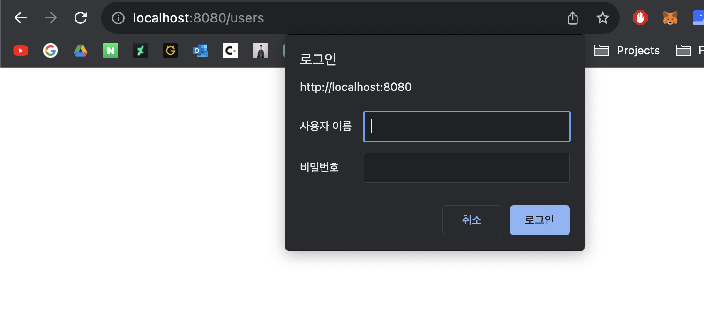

---

## CORS Filter - 손님 가려 받아라

CORS, Cross-Origin Resource Sharing란 서버가 다른 출처로부터의 접근을 허용하거나 제한할 수 있게 하는 HTTP 헤더 기반의 메커니즘이다. 기본적으로 브라우저는 현재 서비스 외의 출처로부터 AJAX 호출을 허용하지 않도록 되어있는데, CORS 설정을 통해 어떤 도메인을 허용할지 혹은 제한할지를 선택할 수 있다. 이는 Spring Boot의 글로벌 설정 혹은 로컬 설정을 통해 구현 가능하다. 

    - 글로벌 설정
    ```java
    (SecurityConfig.java)
    ...
    @Bean
    public WebMvcConfigurer corsConfigurer() {
        return new WebMvcConfigurer() {
            public void addCorsMappings(CorsRegistry registry) {
                registry.addMapping("/**")
                .allowedMethods("*")
                .allowedOrigins("http://localhost:3000");
            }
        };
    }
    ...
    ```
    - 로컬 설정
        - @CrossOrigin: 모든 출처 허용
        - @CrossOrigin(origins = "https://www.google.com): 특정 출처만 허용

---
        
## 메모리에 사용자 자격증명 저장하기

사용자의 인증 정보는 다음과 같은 저장소에 저장될 수 있다.
- 메모리: 테스트 목적으로만 사용하며 실제 상황에선 사용하지 않는다. 다음과 같이 유저 정보를 정의하여 메모리에 저장할 수 있다. 이대로 앱을 실행하면 로그인 창이 뜨는데 이때 ade/haha 혹은 admin/haha로 접속하면 된다.
    ```java
    (SecurityConfig.java)
    ...
    @Bean
    public UserDetailsService userDetailsService(DataSource source) {
        var user = User.withUsername("ade")
            .password("{noop}haha") // {noop}은 별도의 인코딩을 하지 않겠다는 의미이다.
            .roles("USER")
            .build();
        var admin = User.withUsername("admin")
            .password("{noop}haha")
            .roles("ADMIN")
            .build();
        return new InMemoryUserDetailsManager(user, admin);
    }
    ...
    ```

- 데이터베이스: JDBC/JPA를 이용해 인증 정보에 접근한다.
    우선 여러가지 의존성이 필요하다. build.gradle에 다음을 추가해주자.
    ```groovy
    dependencies {
        ...
        implementation 'org.springframework.boot:spring-boot-starter-jdbc'
        implementation 'com.h2database:h2'
        implementation 'org.springframework.boot:spring-boot-devtools'
        ...
    }
    ```
    
    그리고 SecurityConfig 클래스에 다음 Bean들을 추가해주자.
    ```java
    (SecurityConfig.java)
    ...
    @Bean
    public DataSource dataSource() {
        return new EmbeddedDatabaseBuilder()
            .setType(EmbeddedDatabaseType.H2)
            .addScript(JdbcDaoImpl.DEFAULT_USER_SCHEMA_DDL_LOCATION)
            .build();
    }

    @Bean
    public UserDetailsService userDetailsService(DataSource dataSource) {
        var user = User.withUsername("ade")
            .password("{noop}haha")
            .roles("USER")
            .build();
        var admin = User.withUsername("admin")
            .password("{noop}haha")
            .roles("ADMIN")
            .build();

         var jdbcUserDetailsManager = new JdbcUserDetailsManager(dataSource);
         jdbcUserDetailsManager.createUser(user);
         jdbcUserDetailsManager.createUser(admin);

         return jdbcUserDetailsManager;
    }
    ...
    ```
    
    이제 앱을 실행시키고 h2-console에 접속해보면 다음과 같이 AUTHORITIES 및 USERS 테이블이 만들어져 있고 이 테이블의 모든 아이템을 조회해보면 미리 정의한 두개의 이용자 정보가 조회될 것이다.
    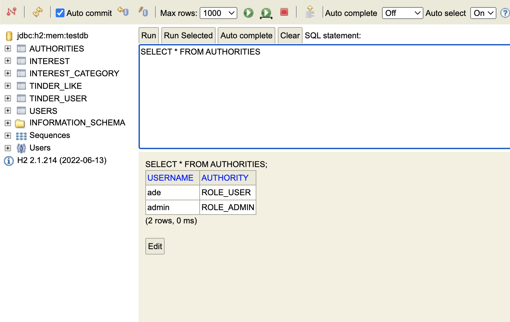
    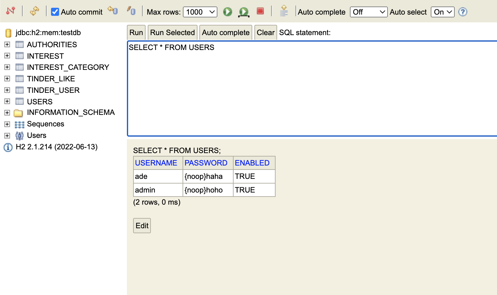
    
    다만 여기서 USERS 테이블에 패스워드의 원문이 그대로 노출되는 것이 좀 그렇다. 다음 장에서 이를 해시하여 저장할 수 있도록 설정을 바꿔보자.
    
- LDAP: Lightweight Directory Access Protocol. 디렉토리 서비스, 인증을 위한 개방형 프로토콜이다.

---

## Bcrypt 인코딩

PasswordEncoder: 패스워드의 단방향 변형(해싱)을 제공하는 인터페이스. Spring Security는 이 인터페이스를 구현한 다양한 클래스들을 가지고 있다. 그 중 하나가 BCryptPasswordEncoder이다. 다음과 같이 BCryptPasswordEncoder를 Bean으로 만들자.
```java
(SecurityConfig.java)
...
@Bean
public BCryptPasswordEncoder bCryptPasswordEncoder() {
    return new BCryptPasswordEncoder();
}
...
```

이제 이 인코더를 이용해 패스워드를 해시하여 저장하도록 하자. 아까 만들었던 userDetailsService Bean을 다음과 같이 수정하자.
```java
(SecurityConfig.java)
...
@Bean
public UserDetailsService userDetailsService(DataSource dataSource) {
    var user = User.withUsername("ade")
            .password("haha") // 인코딩 처리하므로 {noop}을 뺐다.
            .passwordEncoder(str-> bCryptPasswordEncoder().encode(str))
            .roles("USER")
            .build();
    var admin = User.withUsername("admin")
        .password("hoho")
        .passwordEncoder(str-> bCryptPasswordEncoder().encode(str))
        .roles("ADMIN")
        .build();

     var jdbcUserDetailsManager = new JdbcUserDetailsManager(dataSource);
     jdbcUserDetailsManager.createUser(user);
     jdbcUserDetailsManager.createUser(admin);

     return jdbcUserDetailsManager;
}
...
```

이렇게 패스워드 인코더를 설정했으니 다시 앱을 실행하고 h2 콘솔에서 결과를 확인해보자.

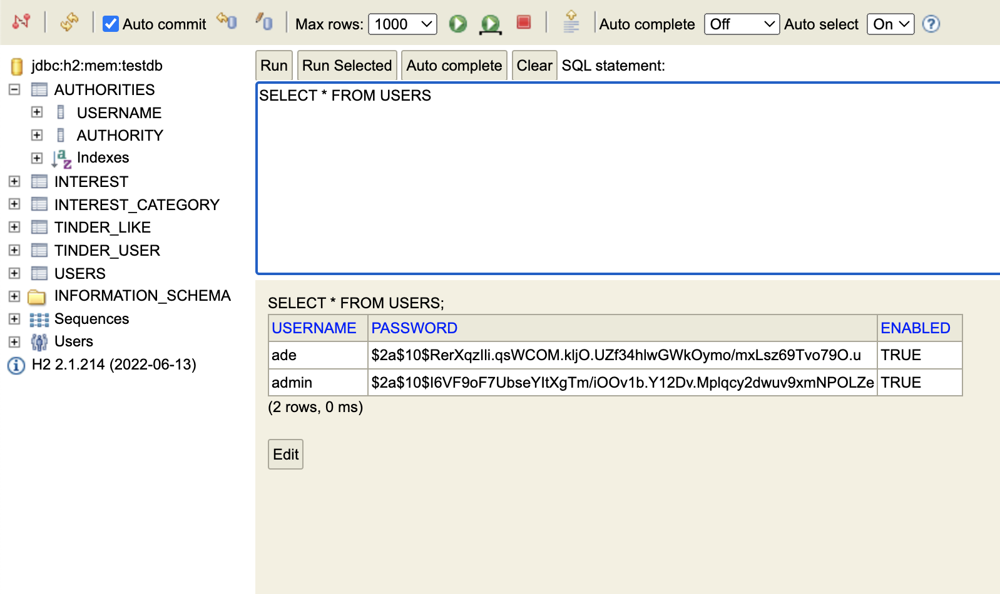

---

## JWT(Json Web Token) 인증

Spring Security 기본 설정에서 인증은 유효기간도 없고, 이용자에 대한 세부정보도 없고, 쉽게 디코딩 할 수 있어 이상적이지 못하다. 그래서 JWT를 사용하는 것이 권장된다. JWT는 개방형 프로토콜에 두 주체간의 클레임을 안전하게 표현하는 업계 표준으로 자리잡았다.

JWT의 구조
- 헤더
    - "typ": "JWT"
    - "alg": "HS256"
- 페이로드
    - "iss"
    - "sub"
    - "aud"
    - "exp"
    - "iat"
    (각 클레임에 대한 세부 내용은 이전 장에서 명시하였다.)
- 서명
    - 헤더 + 페이로드를 개인키로 서명
    - 공개키

Spring Boot의 OAuth2 리소스 서버를 이용한 JWT 검증
1. 키 페어 생성 (java.security.KeyPairGenerator 혹은 openssl 이용)
    ```java
    (SecurityConfig.java)
    ...
    @Bean
    public KeyPair KeyPair() {
        try {
        var keyPairGenerator = KeyPairGenerator.getInstance("RSA");
            keyPairGenerator.initialize(2048);
            return keyPairGenerator.generateKeyPair();
        } catch (Exception e) {
            throw new RuntimeException(e);
        }
    }
    ...
    ```

2. RSA키 생성 (com.nimbusds.jose.j2k.RSAKey)
    ```java
    (SecurityConfig.java)
    ...
    @Bean
    public RSAKey rsaKey(KeyPair keyPair) {
        return new RSAKey.Builder((RSAPublicKey) keyPair.getPublic())
            .privateKey(keyPair.getPrivate())
            .keyID(UUID.randomUUID().toString())
            .build();
    }
    ...
    ```

3. JWKSource(JSON Web Key source) 생성
    - RSA 키로 JWKSet을 만든다.
    - JSWKSet로 JWKSource를 만든다.
    ```java
    (SecurityConfig.java)
    ...
    @Bean
    public JWKSource<SecurityContext> jwkSource(RSAKey rsaKey) {
        var jwkSet = new JWKSet(rsaKey);
        return (jwkSelector, context)->jwkSelector.select(jwkSet);
    }
    ...
    ```

4. RSA 공개키로 디코딩 (NimbusJwtDecoder.withPublicKey(rsaKey().toRSAPublicKey()).build())
    ```java
    (SecurityConfig.java)
    ...
    @Bean
    public JwtDecoder jwtDecoder(RSAKey rsaKey) throws JOSEException {
        return NimbusJwtDecoder
            .withPublicKey(rsaKey.toRSAPublicKey())
            .build();
    }
    ...
    ```

5. JWKSource로 인코딩 (new NimbusJwtEncoder(jwkSource()))


