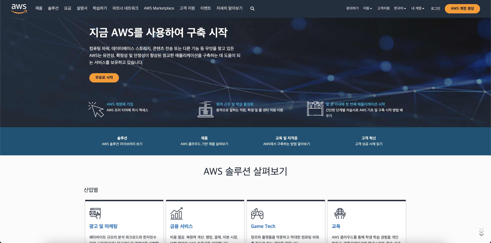
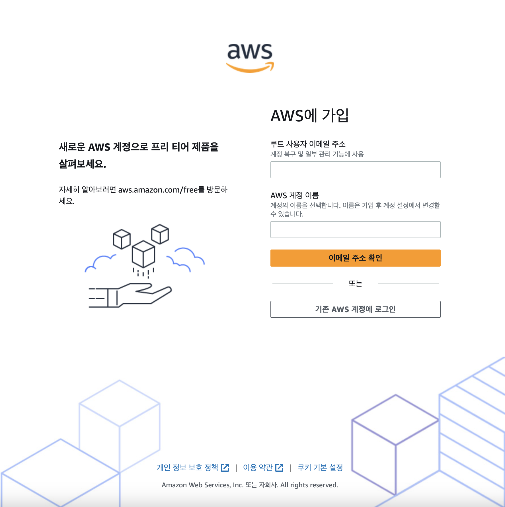
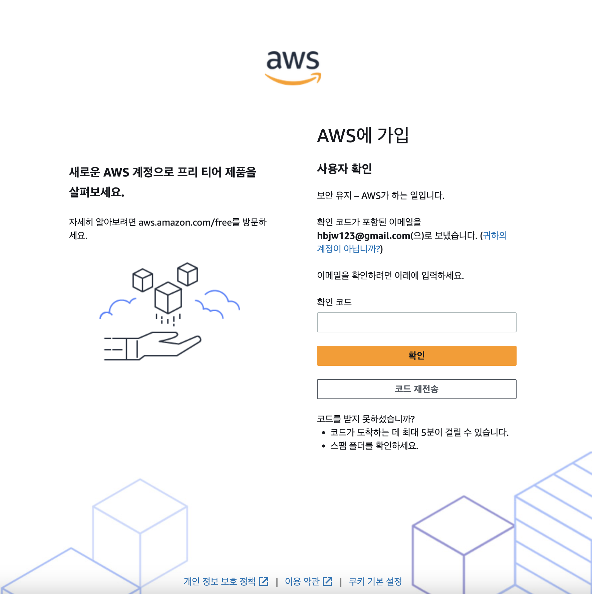
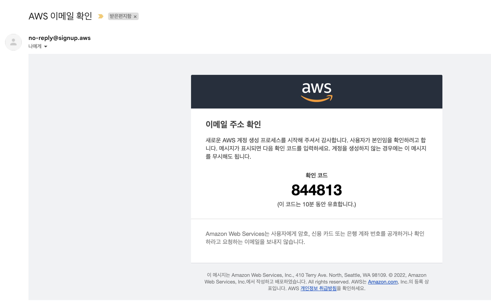
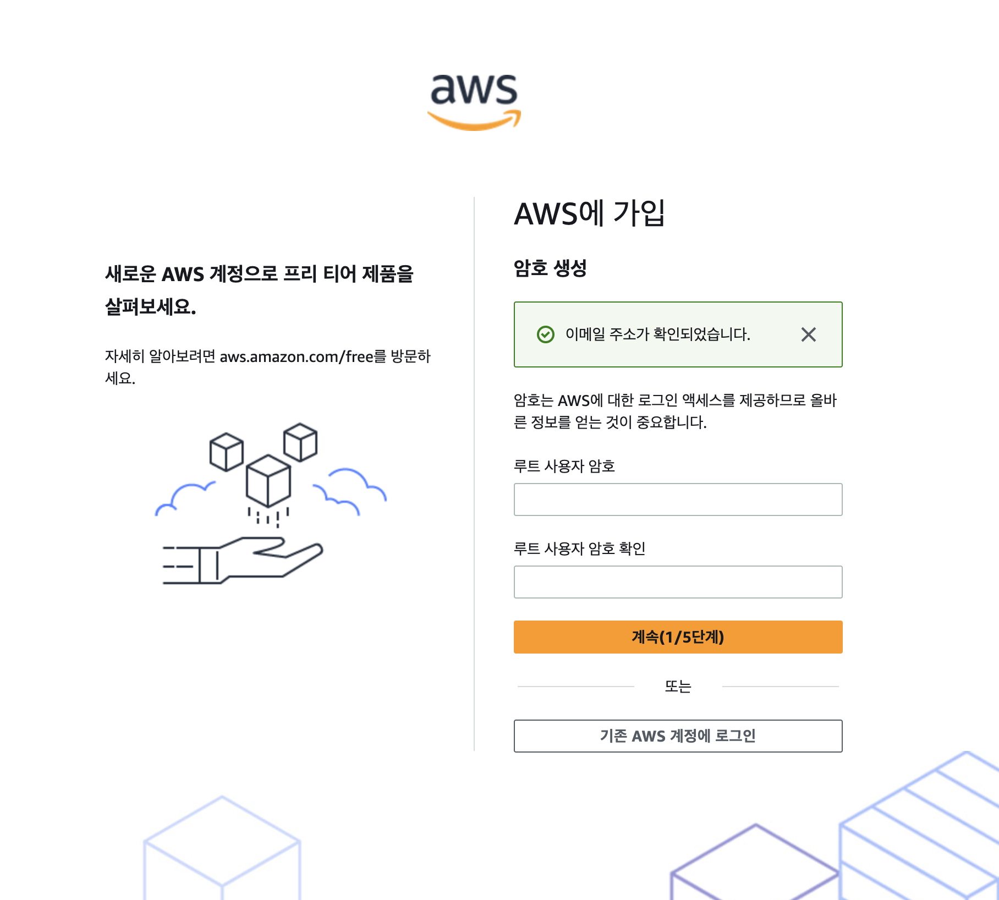
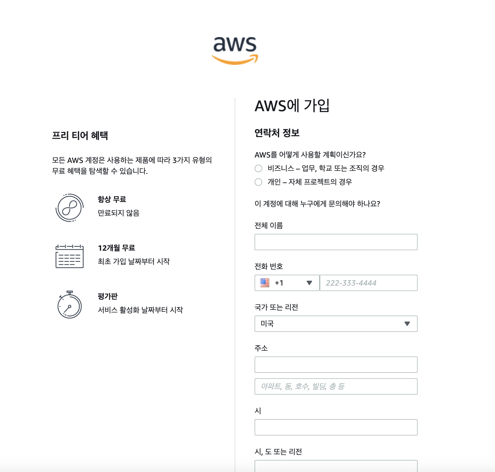
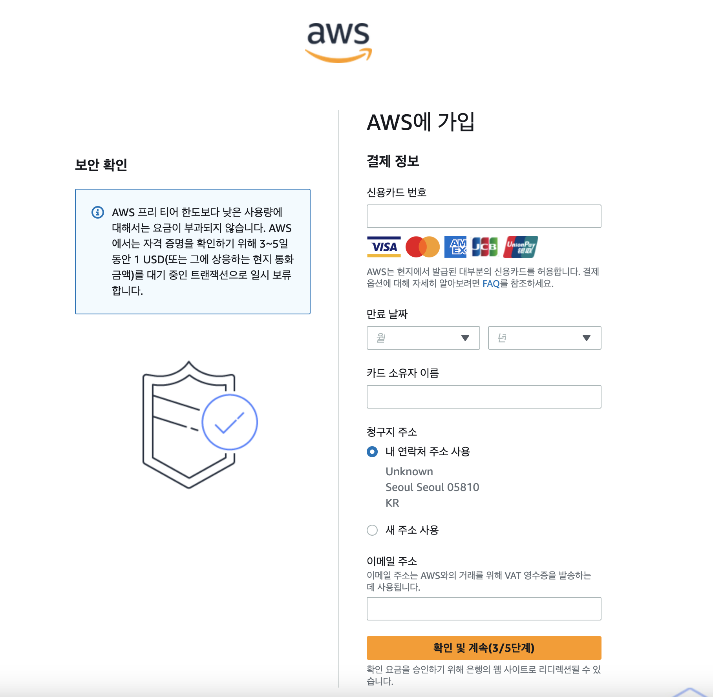
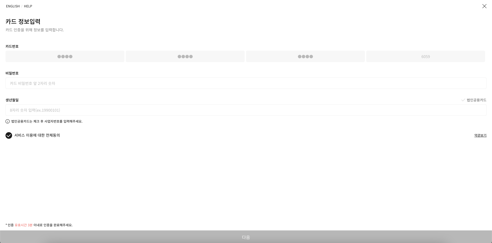
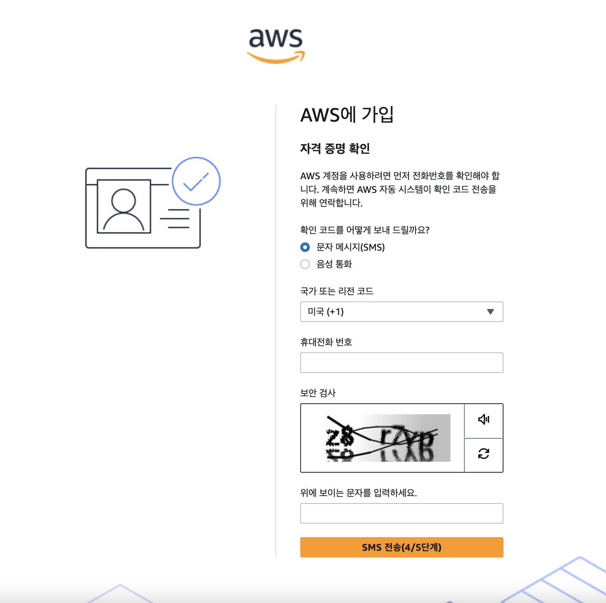

# 클라우드 및 AWS 시작하기

## AWS 계정 생성하기

1. [https://aws.amazon.com/ko](https://aws.amazon.com/ko) 접속, 'AWS 계정 생성' 클릭

2. 이메일과 계정 이름을 입력한다.

3. 입력한 이메일로 인증코드가 날아갔을 것이다. 코드를 입력해주자.

4. 패스워드를 두번 입력한다.

5. 개인정보를 입력한다. 전부 써야하고 영어로 써야 한다. 주소 같은건 대충 아무 말이나 써도 넘어간다.

6. 결제 정보를 입력한다. 해외결제 되는 카드를 준비해야 할 것이다.

7. 계속 결제 정보를 입력한다. 모두 입력하고 다음을 누르면 입력한 카드로부터 100원이 출급됐다가 취소될 것이다. 100원도 없는 카드면 어떻게 되는거지...?

8. 전하번호 인증의 시간이다.

9. 인증번호를 받아서 입력하자.

10. 마지막으로 멤버십을 선택한다. 무료로 한다.

11. 가입 완료. 이제 루트 사용자로써 계정이 생성되었다.

## IAM 사용자 생성하기

IAM: Identity and Access Management. 인증(Authentication)과 인가(Authorization)

루트 유저는 모든 권한을 가진다. IAM 유저는 인증과 인가에 관련된, 제한적인 권한을 가진다. 따라서 가급적이면 IAM 계정을 사용하는 것이 보안상 안전하다. 루트 계정에서 개발자 그룹을 생성한 후, 그 그룹 소속의 IAM 계정을 만들어보도록 하자. 

1. IAM 그룹 생성
우선 루트 계정으로 로그인한 후, AWS 콘솔에서 검색창에 IAM을 친다. IAM 대시보드로 들어간다. 

##
