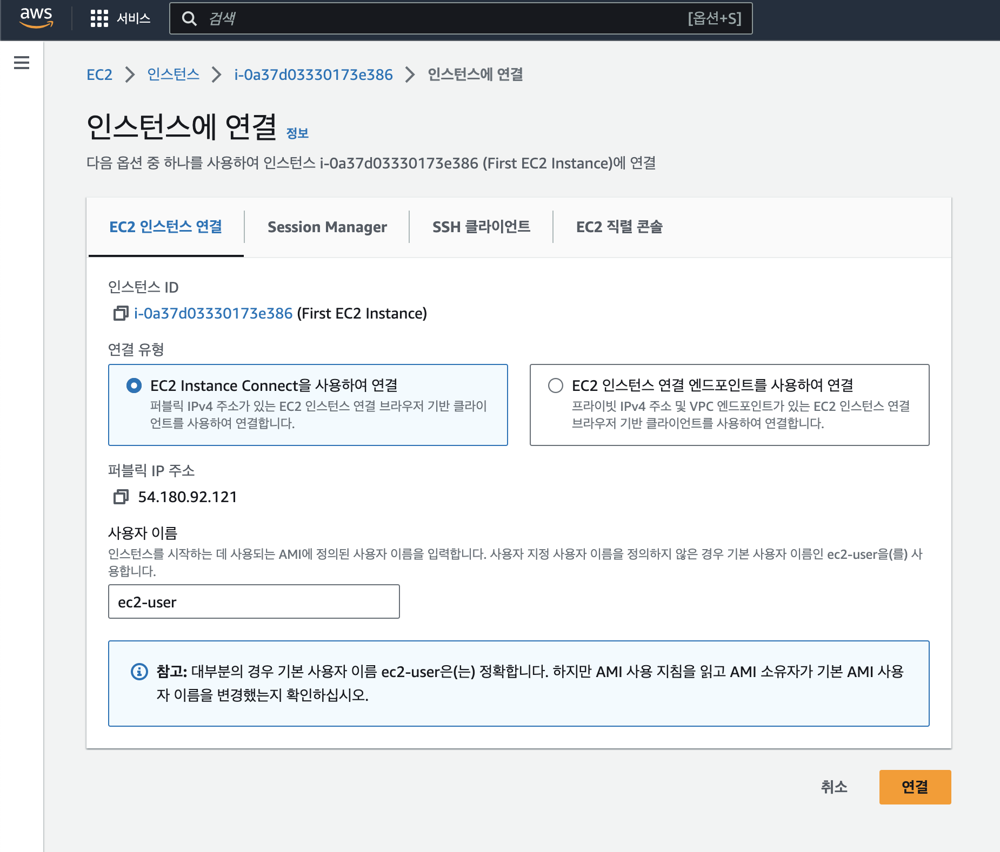

# EC2 인스턴스 생성하기

1. AWS 콘솔에서 EC2 검색 

2. 리전을 선택해준다. 현재 위치에서 가장 가까운 아시아 태평양(서울)로 설정하자. 그리고 '인스턴스 시작'을 클릭한다.

 
3. 인스턴스 설정을 해야 하는데 여러가지 항목들이 있다. 제일 먼저 이름을 적절히 입력해주고

4. **AMI**를 선택해준다. AMI란 **Amazon Machine Image**라는 뜻으로, 인스턴스를 어떤 OS로 실행할 것인지를 결정하는 것이다. 아마존 리눅스 중 기본으로 설정되어있는 것을 그대로 가져간다.
 

5. 다음은 어떤 사양의 컴퓨터를 사용할지 결정한다. 이는 여러가지 하위 설정으로 구성되는데, 이들을 통틀어 **인스턴스 패밀리**라고 부른다. 그 중 하나인 **인스턴스 사이즈**는 CPU 및 메모리 구성에 따른 컴퓨터의 기본적인 사양을 결정한다. 우선 프리 티어로 사용할 수 있는 t2.micro로 선택하였다.

6. 다음으로 로그인을 위한 키페어를 생성한다. 키페어 이름은 알아서 설정하고 유형은 RSA로 하여 생성해준다. 생성된 키페어는 선택한 형식의 파일로 다운로드 될 것이다. 키페어의 공개키는 EC2 인스턴스에 내장되고, 개인키는 내가 다운받아 직접 관리한다.

7. 다음은 네트워크 보안 설정이다. 그냥 기본 설정 그대로 가면 된다. 새 보안 그룹 생성하고 모든 SSH 트래픽을 허용하도록 설정한다. **보안 그룹(Security Group)**은 인스턴스로 들어가고 나가는 트래픽에 대한 가상 방화벽을 제공한다. 

8. 마지막으로 인스턴스 패밀리 설정 중 하나인 스토리지 설정이다. gp3라는 이름의 SSD를 8기가 사용하도록 세팅되어있다. 여기에 볼륨을 추가하면 EBS(Elastic Block Store)라는 이름의 스토리지가 추가된다.

9. 지금까지 설정한 것을 확인하고 '인스턴스 시작'을 눌러준다.

10. 잠시 기다리면 성공적으로 인스턴스가 생성된다.

11. 만들어진 인스턴스 주소를 클릭하여 들어가면 다음과 같이 인스턴스 정보를 확인할 수 있다. 

12. 만들어진 인스턴스를 선택하고 연결 버튼을 클릭한다.

13. 연결 유형은 'EC2 Instance Connect을 사용하여 연결', 사용자 이름은 적당히 입력하고 '연결'을 클릭한다.

14. 성공적으로 터미널 화면이 뜬 것을 확인할 수 있다.

15. 인스턴스 사용을 종료하려면 인스턴스를 선택하고 인스턴스 상태 > 인스턴스 종료를 클릭한다. 사용이 끝난 인스턴스는 바로바로 종료해주는 것이 좋다.

