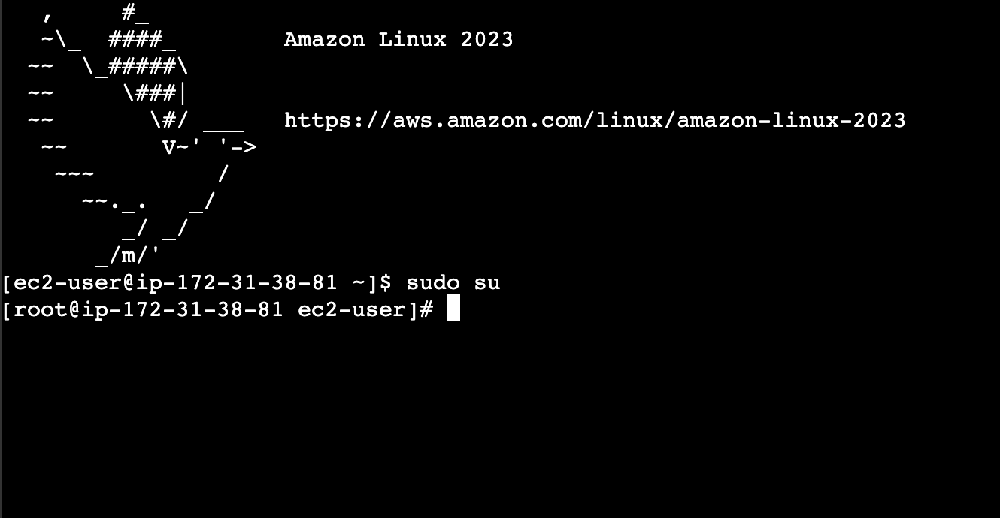
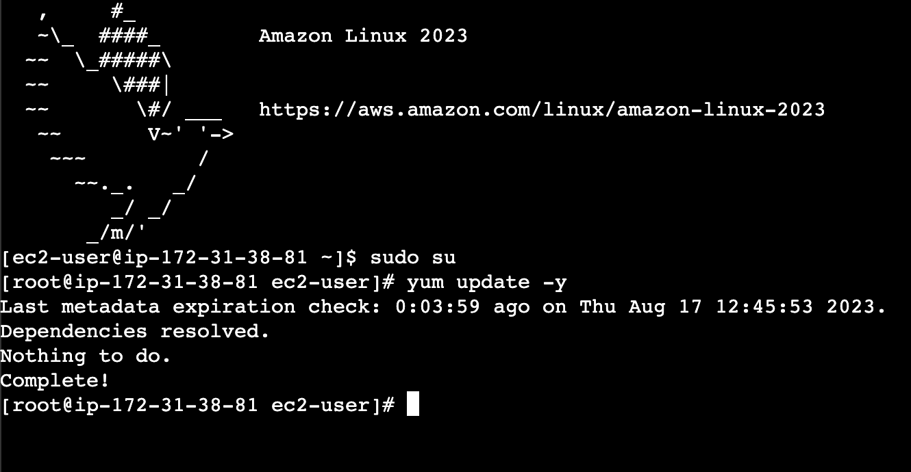
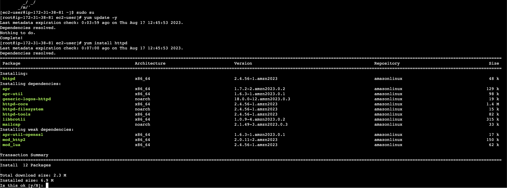
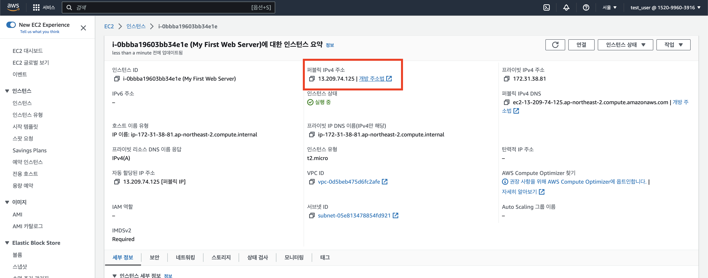
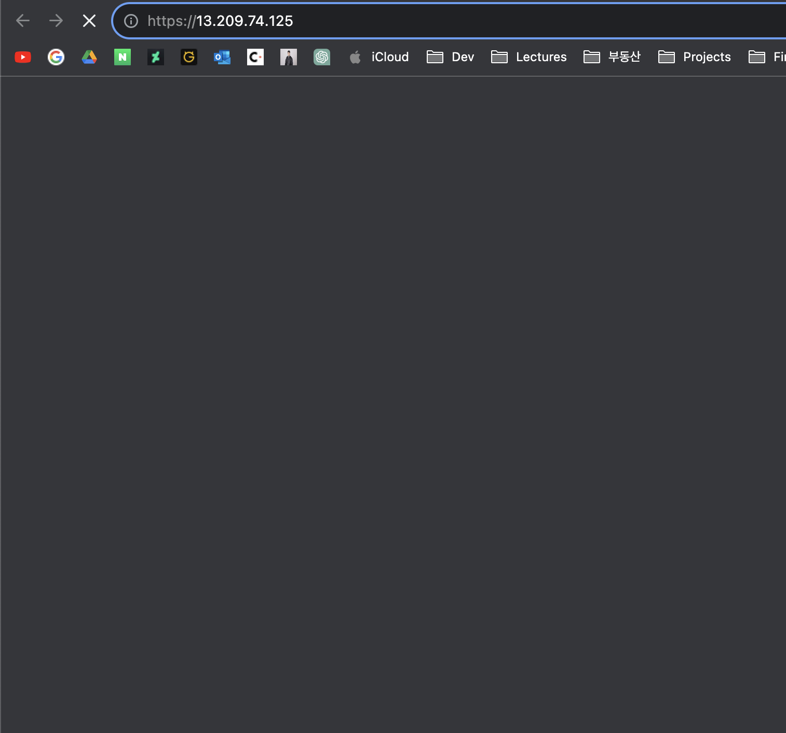
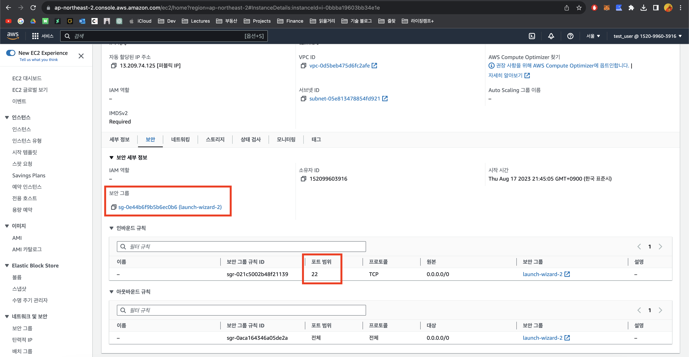
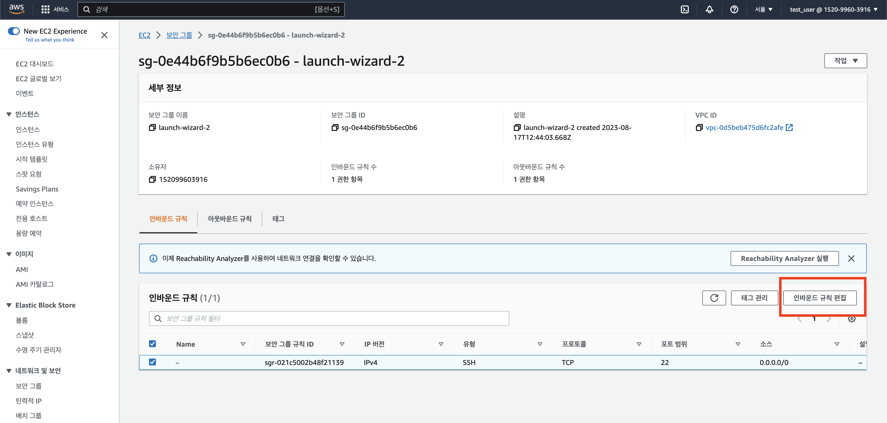
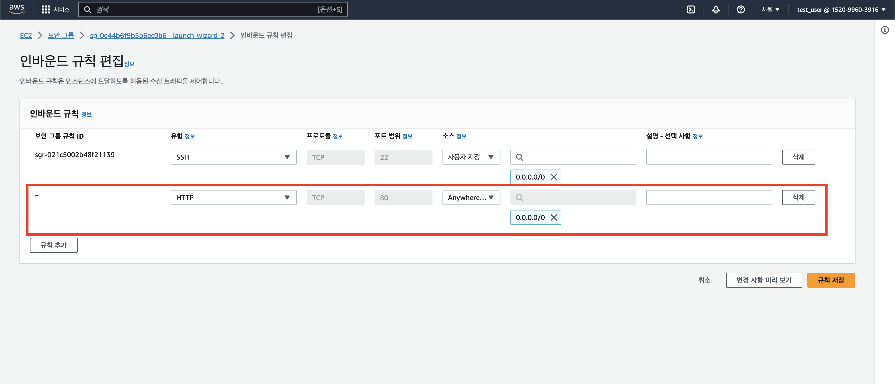
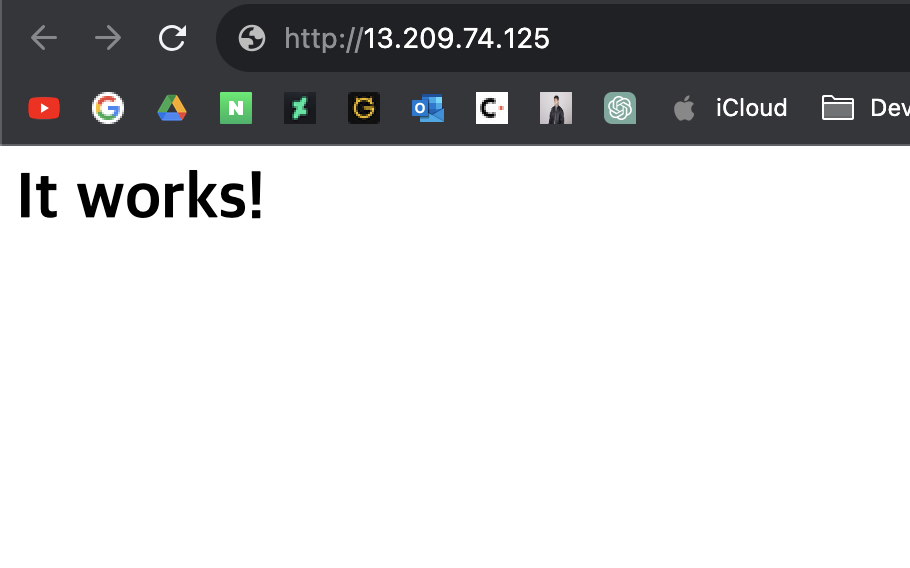

# EC2 인스턴스에 웹 서버 올리기

이제 EC2 인스턴스를 만드는 법을 알았으니 여기에 서버를 올려보도록 하자. EC2 인스턴스에 아파치 웹 서버를 올릴 것인데 그러려면 우선 인스턴스 내에서 관리자 권한을 얻어야 한다. EC2 터미널 화면에서 다음 명령어를 입력하자.

```
sudo su
```

그 결과, 다음과 같이 루트 경로로 이동한 것을 알 수 있다.


다음으로, 패키지 매니저를 통해 필요한 라이브러리를 설치해야 하는데 아마존 리눅스에서 기본적으로 설치된 패키지 매니저는 'yum'이다. 다음과 같은 명령어를 입력하여 현재 상태에서 업데이트가 필요한 라이브러리가 있는지 확인하자.

```
yum update -y
```

이제 막 만든 인스턴스니까 딱히 업데이트 할 것은 없을 것이다.


그럼 필요한 것들을 설치하자. 아파치 웹 서버 라이브러리인 'httpd'를 다음과 같은 명령어로 설치한다.

```
yum install httpd
```

터미널은 설치할지 말지 물을 것이고 'y'를 입력하여 설치하자.


설치가 끝났으면 다음 명령어를 입력하여 웹 서버를 실행하자.

```
systemctl start httpd
```

별다른 출력이 없었을 것이지만 웹 서버가 실행되었다. 이를 확인하기 위해 콘솔의 인스턴스 정보 창으로 가보자. 다음과 같이 퍼블릭 IP 주소를 확인할 수 있는데 이 주소를 따라 들어가보자.
 

아직 아무것도 뜨지 않는다! 왜냐면 네트워크 설정에서 보안 그룹을 생성했기 때문이다. 인스턴스 정보 창에서 보안 탭을 보자.
 

우선 '포트 범위'가 22로 설정된 것을 알 수 있다. 그럼 포트만 설정해주면 되느냐, 그것도 아니다. 아까 인스턴스를 생성할 때, SSH 트래픽만 허용하도록 한 것을 잊었는가? 일반적인 http 혹은 https 통신으로는 접근할 수 없도록 설정되어있다. 이를 수정하기 위해 보안 그룹 링크를 따라 들어가보자.
 

'인바운드 규칙 편집'을 클릭한다.


다음과 같이 HTTP에 0.0.0.0/0로 접근을 허용하는 규칙을 추가하고 저장한다. 모든 HTTP 트래픽을 허용한다는 뜻이다.


이제 다시 퍼블릭 아이피에 http 스킴으로 접속하면 된다.

