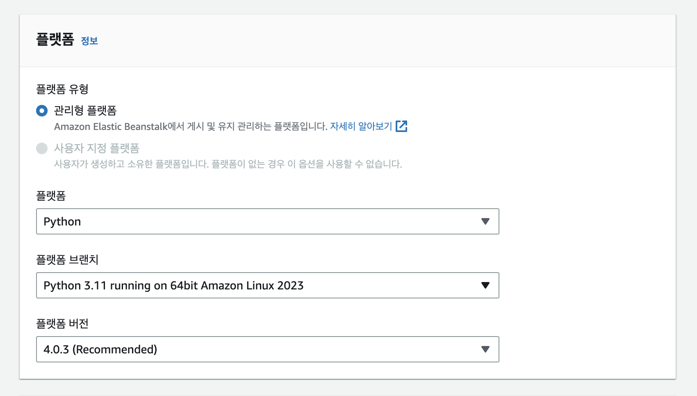
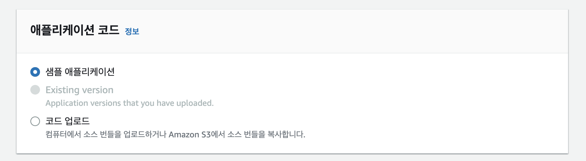
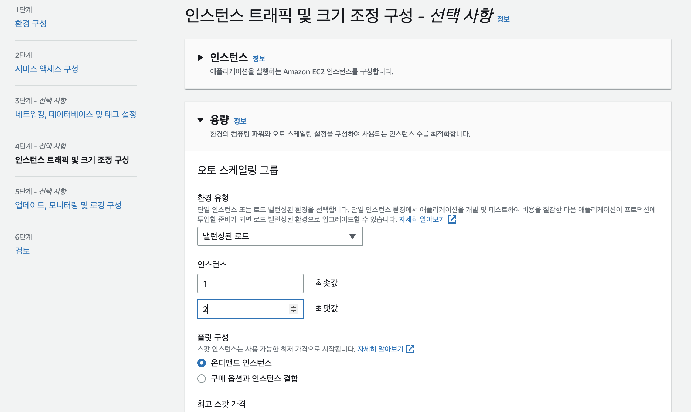

# AWS Elastic Beanstalk

## 클라우드 서비스의 종류: IaaS vs. Paas

- IaaS (Infrastructure as a Service)
    - 클라우드 프로바이더는 인프라만 제공한다.
        - 하드웨어
        - 네트워크
        - 시각화 인터페이스
    - 나머지는 내가 알아서 해야한다.
        - OS 업그레이드 및 패치
        - 어플리케이션 코드 및 런타임
        - 로드 밸런싱
        - 오토 스케일링(트래픽 양에 따라 인스턴스 수 조절)
        - Availability(충돌한 인스턴스를 정상 인스턴스로 교체하는 작업)

- PaaS (Platform as a Service)
    - 클라우드 프로바이더는 플랫폼을 제공한다.
        - 하드웨어
        - 네트워크
        - 시각화 인터페이스
        - OS
        - 어플리케이션 런타임
        - 오토 스케일링, 로드 밸런싱, Availability 등등..
    - 내가 할 일은
        - 설정
        - 어플리케이션 코드
    - Compute: AWS Elastic Beanstalk, Azure App Service, Google App Engine
    - Database: Amazon RDS, Google Cloud SQL, Azure SQL Database
    - 그외 Queues, AI, ML, Operations, DevOps 등등

---

## AWS Elastic Beanstalk

- AWS를 통해 웹 앱을 운영하는 가장 간편한 방법.
- 종단간 어플리케이션 관리 (end-to-end web application management)
- Java, .NET, Node.js, PHP, Ruby, Python, Go, Docker를 지원.
- 다른 AWS 리소스를 사용하지 않을 경우, 별도의 요금은 없다.
- 자동 로드 밸런싱 지원.
- 오토 스케일링 지원.
- 관리형 플랫폼 업데이트 지원

### Elastic Beanstalk 생성하기

1. 콘솔 화면에서 Elastic Beanstalk를 검색하여 대시보드로 들어간다.

2. '애플리케이션 생성' 클릭. 먼저 환경을 구성하고 그 위에 어플리케이션을 올리게 될 것이다.

3. 이름을 입력하고 플랫폼을 선택한다. 여기선 파이썬을 선택했다. 그리고 샘플 어플리케이션 코드를 선택하여 설치 후 바로 결과를 확인할 수 있도록 하였다. 다른 설정들은 모두 기본으로 놔두고 다음을 선택한다.

4. 다음 단계인 '서비스 액세스 구성'의 '서비스 역할' 항목에서 '새 서비스 역할 생성 및 사용'을 선택한다. 원래 AWS 공식 문서에는 직접 IAM 대시보드로 가서 역할 프로필을 생성하라고 하지만 긴 뻘짓 끝에 실패하고 이 옵션을 선택하기로 하였다. 자동으로 'aws-elasticbeanstalk-service-role'라는 역할 프로필이 만들어질 것이다. 이제 '검토 단계로 건너뛰기'를 선택한다. 나머지 단계들은 지금 신경 쓸 필요 없다.

5. '네트워킹, 데이터베이스 및 태그 설정'은 건너뛰고 '인스턴스 트래픽 및 크기 조정 구성' 단계로 간다. 여기서 오토 스케일링 그룹 > 환경 유형을 '밸런싱된 로드'...그러니까 Load Balancing으로 설정한다. 그리고 인스턴스의 최소 및 최대 갯수는 각각 1개와 2개로 설정한다. 나머지 설정은 그대로 두고 설정을 마친다.

10. 검토 단계에서 '제출'을 눌러 환경 생성을 완료한다.

5. ELB가 생성되었다. 모든 설정이 완료되려면 십여분을 기다려야 할 것이다.
 

### Elastic Beanstalk 사용하기
