# AWS 컴퓨팅 서비스

## EC2

EC2: Elastic Compute Cloud. 대여할 수 있는 가상 머신

핵심 기능
- EC2 인스턴스의 생명주기 관리
- EC2 인스턴스에 스토리지 추가
- 다수의 EC2 인스턴스들 사이의 로드 밸런싱

---

## EC2 인스턴스 생성하기

1. AWS 콘솔에서 EC2 검색 


2. 리전을 선택해준다. 현재 위치에서 가장 가까운 아시아 태평양(서울)로 설정하자. 그리고 '인스턴스 시작'을 클릭한다.
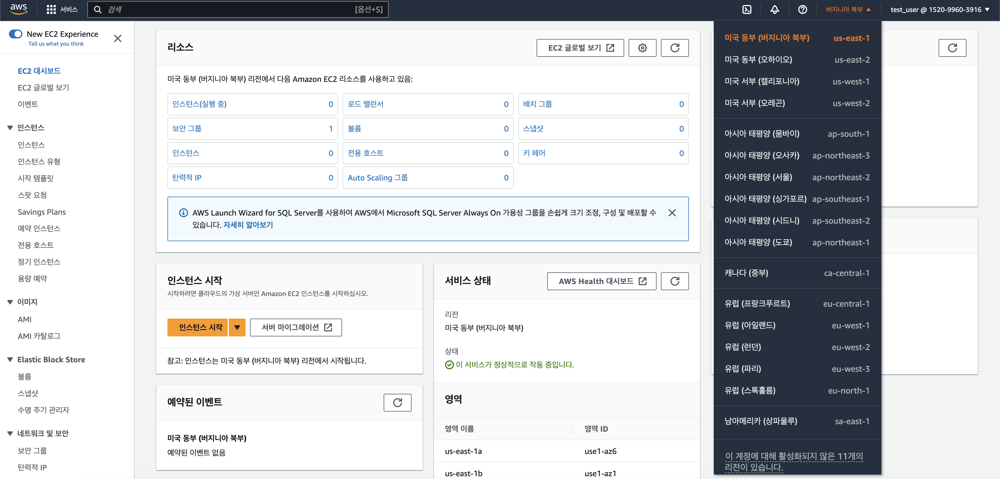
 
3. 인스턴스 설정을 해야 하는데 여러가지 항목들이 있다. 제일 먼저 이름을 적절히 입력해주고
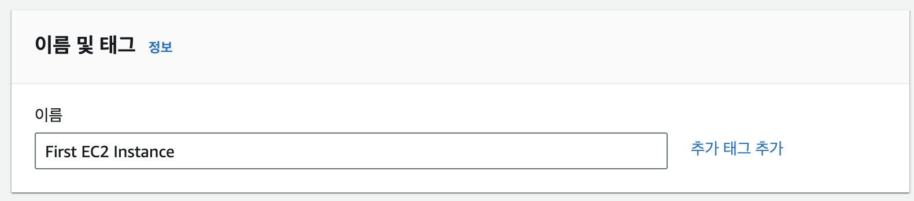

4. **AMI**를 선택해준다. AMI란 **Amazon Machine Image**라는 뜻으로, 인스턴스를 어떤 OS로 실행할 것인지를 결정하는 것이다. 아마존 리눅스 중 기본으로 설정되어있는 것을 그대로 가져간다.
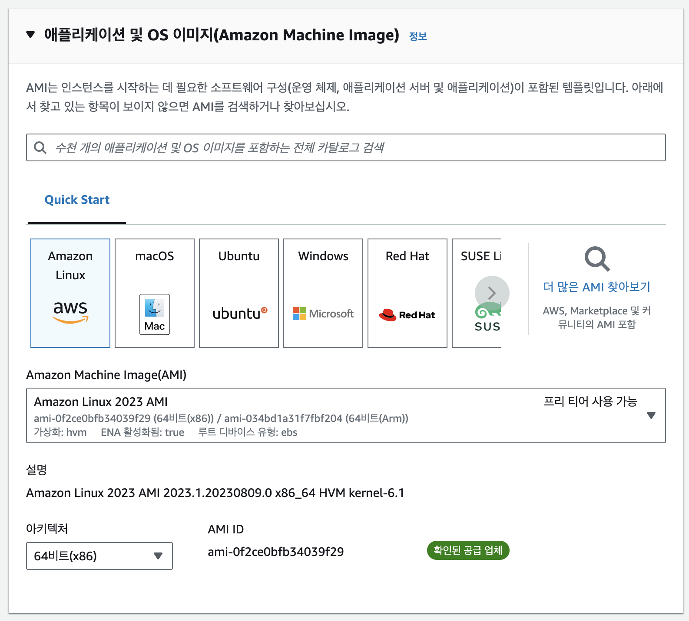 

5. 다음은 어떤 사양의 컴퓨터를 사용할지 결정한다. 이는 여러가지 하위 설정으로 구성되는데, 이들을 통틀어 **인스턴스 패밀리**라고 부른다. 그 중 하나인 **인스턴스 사이즈**는 CPU 및 메모리 구성에 따른 컴퓨터의 기본적인 사양을 결정한다. 우선 프리 티어로 사용할 수 있는 t2.micro로 선택하였다.


6. 다음으로 로그인을 위한 키페어를 생성한다. 키페어 이름은 알아서 설정하고 유형은 RSA로 하여 생성해준다. 생성된 키페어는 선택한 형식의 파일로 다운로드 될 것이다. 키페어의 공개키는 EC2 인스턴스에 내장되고, 개인키는 내가 다운받아 직접 관리한다.
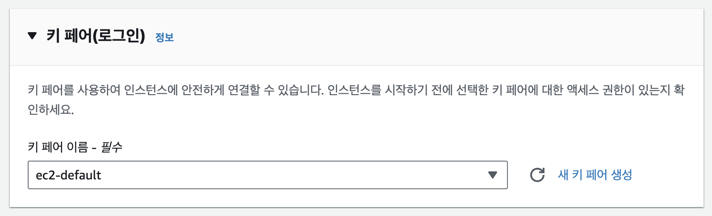

7. 다음은 네트워크 보안 설정이다. 그냥 기본 설정 그대로 가면 된다. 새 보안 그룹 생성하고 모든 SSH 트래픽을 허용하도록 설정한다. **보안 그룹(Security Group)**은 인스턴스로 들어가고 나가는 트래픽에 대한 가상 방화벽을 제공한다. 
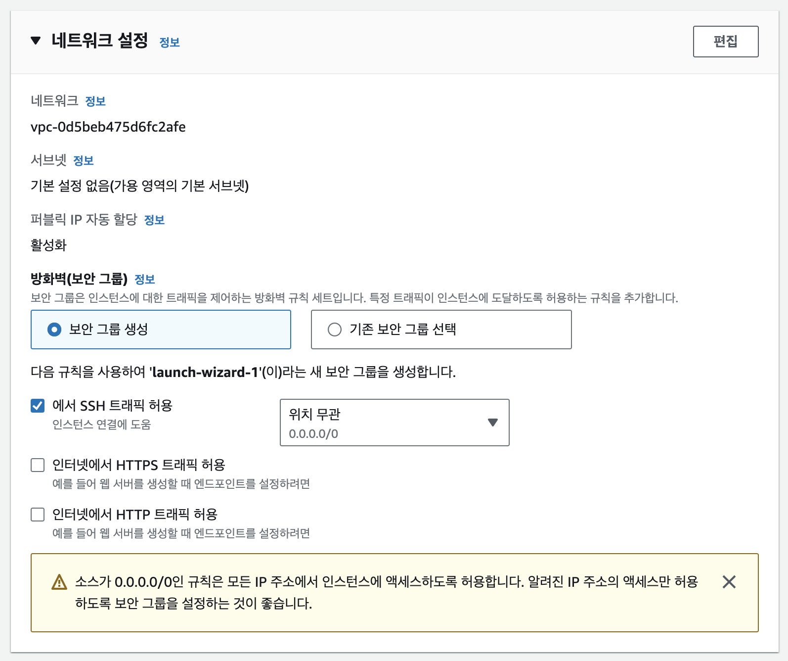

8. 마지막으로 인스턴스 패밀리 설정 중 하나인 스토리지 설정이다. gp3라는 이름의 SSD를 8기가 사용하도록 세팅되어있다. 여기에 볼륨을 추가하면 EBS(Elastic Block Store)라는 이름의 스토리지가 추가된다.
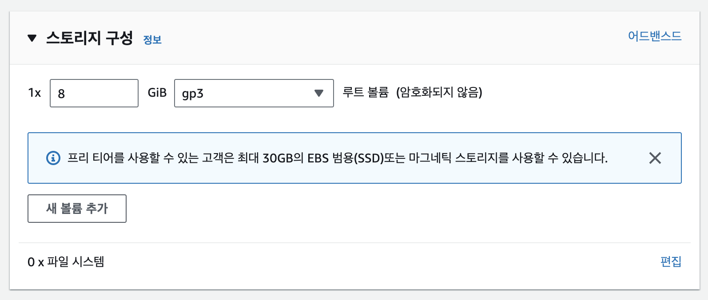

9. 지금까지 설정한 것을 확인하고 '인스턴스 시작'을 눌러준다.


10. 잠시 기다리면 성공적으로 인스턴스가 생성된다.
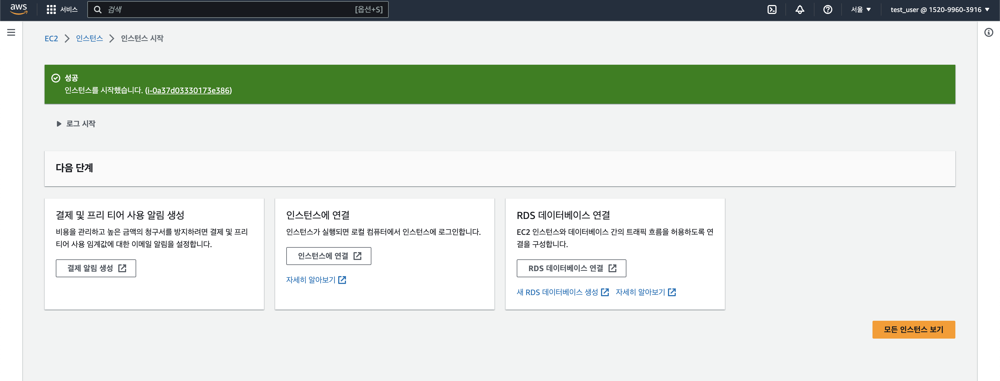

11. 만들어진 인스턴스 주소를 클릭하여 들어가면 다음과 같이 인스턴스 정보를 확인할 수 있다. 


12. 만들어진 인스턴스를 선택하고 연결 버튼을 클릭한다.


13. 연결 유형은 'EC2 Instance Connect을 사용하여 연결', 사용자 이름은 적당히 입력하고 '연결'을 클릭한다.


14. 성공적으로 터미널 화면이 뜬 것을 확인할 수 있다.


15. 인스턴스 사용을 종료하려면 인스턴스를 선택하고 인스턴스 상태 > 인스턴스 종료를 클릭한다. 사용이 끝난 인스턴스는 바로바로 종료해주는 것이 좋다.


---

## EC2 인스턴스에 웹 서버 올리기

이제 EC2 인스턴스를 만드는 법을 알았으니 여기에 서버를 올려보도록 하자. EC2 인스턴스에 아파치 웹 서버를 올릴 것인데 그러려면 우선 인스턴스 내에서 관리자 권한을 얻어야 한다. EC2 터미널 화면에서 다음 명령어를 입력하자.

```
sudo su
```

그 결과, 다음과 같이 루트 경로로 이동한 것을 알 수 있다.
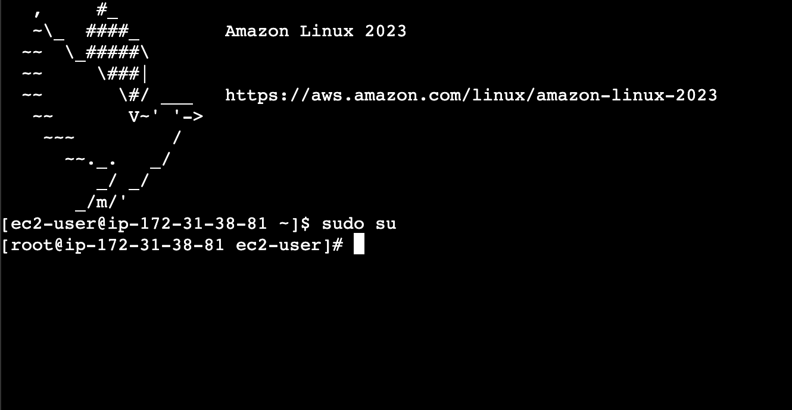

다음으로, 패키지 매니저를 통해 필요한 라이브러리를 설치해야 하는데 아마존 리눅스에서 기본적으로 설치된 패키지 매니저는 'yum'이다. 다음과 같은 명령어를 입력하여 현재 상태에서 업데이트가 필요한 라이브러리가 있는지 확인하자.

```
yum update -y
```

이제 막 만든 인스턴스니까 딱히 업데이트 할 것은 없을 것이다.


그럼 필요한 것들을 설치하자. 아파치 웹 서버 라이브러리인 'httpd'를 다음과 같은 명령어로 설치한다.

```
yum install httpd
```

터미널은 설치할지 말지 물을 것이고 'y'를 입력하여 설치하자.


설치가 끝났으면 다음 명령어를 입력하여 웹 서버를 실행하자.

```
systemctl start httpd
```

별다른 출력이 없었을 것이지만 웹 서버가 실행되었다. 이를 확인하기 위해 콘솔의 인스턴스 정보 창으로 가보자. 다음과 같이 퍼블릭 IP 주소를 확인할 수 있는데 이 주소를 따라 들어가보자.
 

아직 아무것도 뜨지 않는다! 왜냐면 네트워크 설정에서 보안 그룹을 생성했기 때문이다. 인스턴스 정보 창에서 보안 탭을 보자.
 

우선 '포트 범위'가 22로 설정된 것을 알 수 있다. 그럼 포트만 설정해주면 되느냐, 그것도 아니다. 아까 인스턴스를 생성할 때, SSH 트래픽만 허용하도록 한 것을 잊었는가? 일반적인 http 혹은 https 통신으로는 접근할 수 없도록 설정되어있다. 이를 수정하기 위해 보안 그룹 링크를 따라 들어가보자.
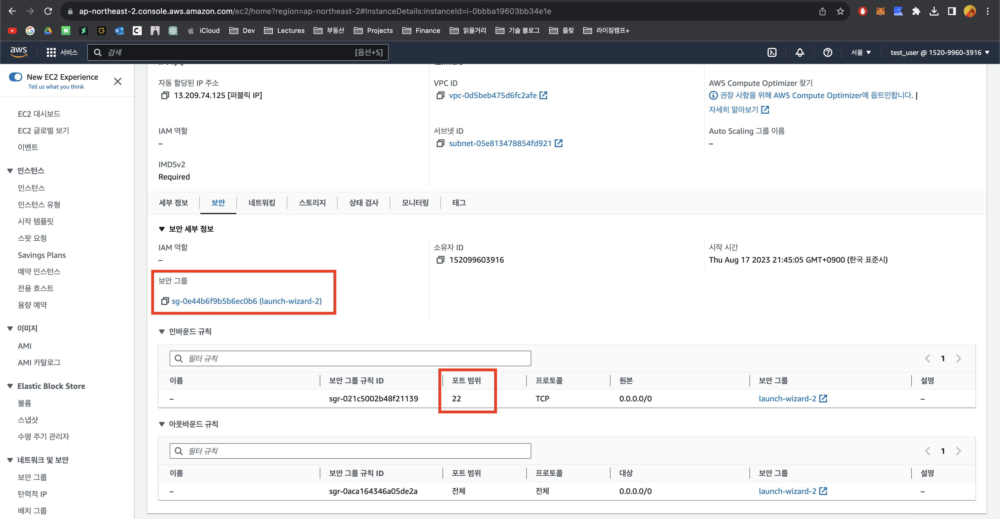 

'인바운드 규칙 편집'을 클릭한다.


다음과 같이 HTTP에 0.0.0.0/0로 접근을 허용하는 규칙을 추가하고 저장한다. 모든 HTTP 트래픽을 허용한다는 뜻이다.


이제 다시 퍼블릭 아이피에 http 스킴으로 접속하면 된다.
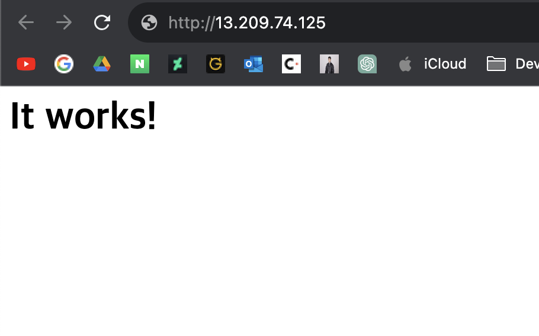

---

## 클라우드 서비스의 종류: IaaS vs. Paas

- IaaS (Infrastructure as a Service)
    - 클라우드 프로바이더는 인프라만 제공한다.
        - 하드웨어
        - 네트워크
        - 시각화 인터페이스
    - 나머지는 내가 알아서 해야한다.
        - OS 업그레이드 및 패치
        - 어플리케이션 코드 및 런타임
        - 로드 밸런싱
        - 오토 스케일링(트래픽 양에 따라 인스턴스 수 조절)
        - Availability(충돌한 인스턴스를 정상 인스턴스로 교체하는 작업)

- PaaS (Platform as a Service)
    - 클라우드 프로바이더는 플랫폼을 제공한다.
        - 하드웨어
        - 네트워크
        - 시각화 인터페이스
        - OS
        - 어플리케이션 런타임
        - 오토 스케일링, 로드 밸런싱, Availability 등등..
    - 내가 할 일은
        - 설정
        - 어플리케이션 코드
    - Compute: AWS Elastic Beanstalk, Azure App Service, Google App Engine
    - Database: Amazon RDS, Google Cloud SQL, Azure SQL Database
    - 그외 Queues, AI, ML, Operations, DevOps 등등

---

## AWS Elastic Beanstalk

- AWS를 통해 웹 앱을 운영하는 가장 간편한 방법.
- 종단간 어플리케이션 관리 (end-to-end web application management)
- Java, .NET, Node.js, PHP, Ruby, Python, Go, Docker를 지원.
- 다른 AWS 리소스를 사용하지 않을 경우, 별도의 요금은 없다.
- 자동 로드 밸런싱 지원.
- 오토 스케일링 지원.
- 관리형 플랫폼 업데이트 지원


### Elastic Beanstalk 생성하기

1. 콘솔 화면에서 Elastic Beanstalk를 검색하여 대시보드로 들어간다.


2. '애플리케이션 생성' 클릭
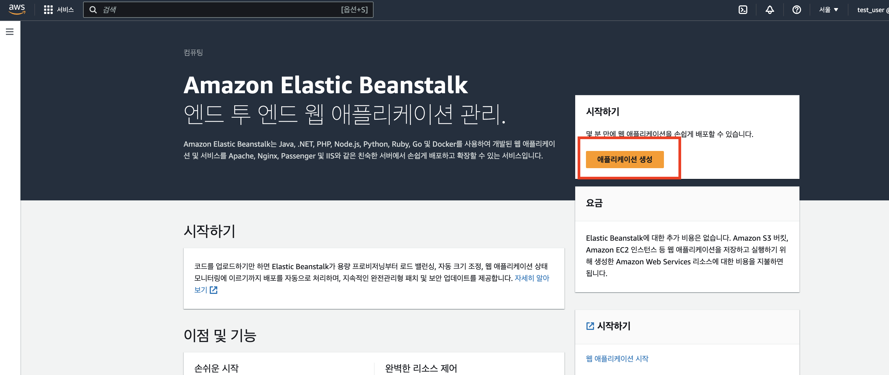

3. 환경을 구성할 단계다. 이름을 입력하고 플랫폼을 선택한다. 여기선 파이썬을 선택했다. 그리고 샘플 어플리케이션 코드를 선택하여 설치 후 바로 결과를 확인할 수 있도록 하였다. 다른 설정들은 모두 기본으로 놔두고 다음을 선택한다.


4. 이후 여러 단계가 나오는데 일단 모두 건너뛰고 '인스턴스 트래픽 및 크기 조정 구성' 단계로 간다. 여기서 환경 유형을 '밸런싱된 로드'...그러니까 Load Balancing으로 설정한다. 그리고 인스턴스의 최소 및 최대 갯수는 각각 1개와 2개로 설정한다. 나머지 설정은 그대로 두고 설정을 마친다.


5. ELB가 생성되었다. 모든 설정이 완료되려면 십여분을 기다려야 할 것이다.
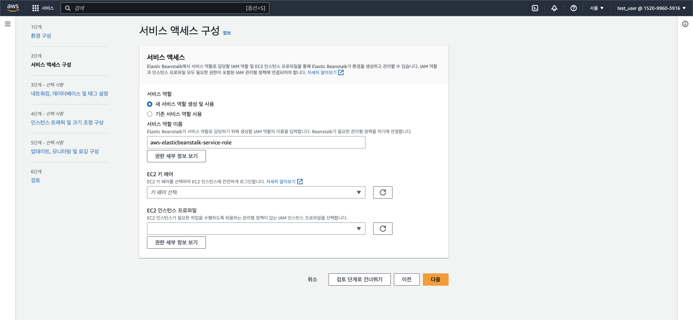 

### Elastic Beanstalk 사용하기
